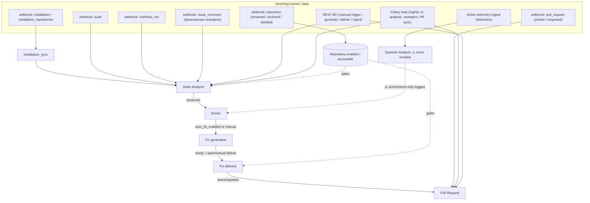
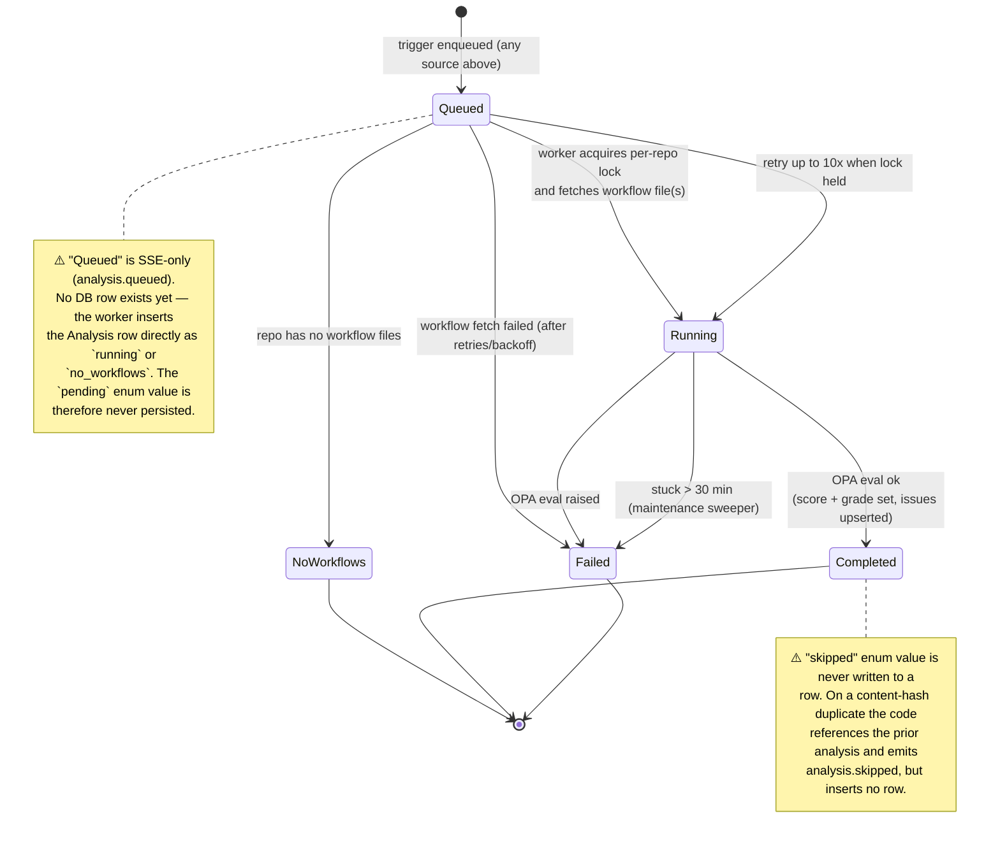
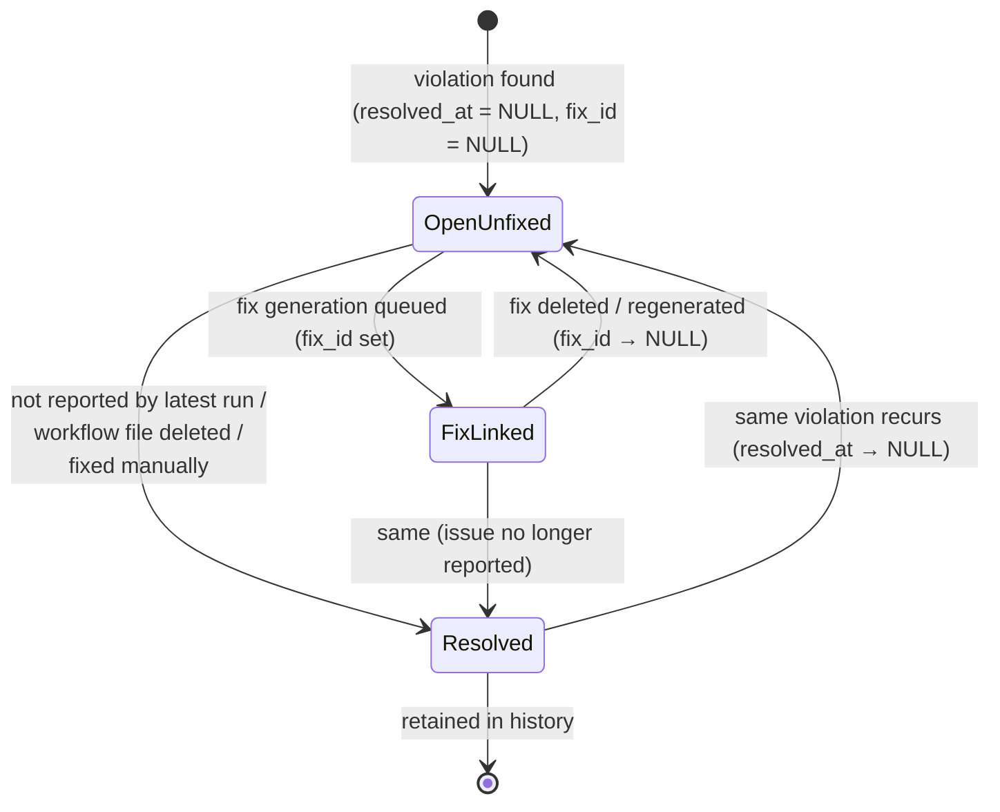
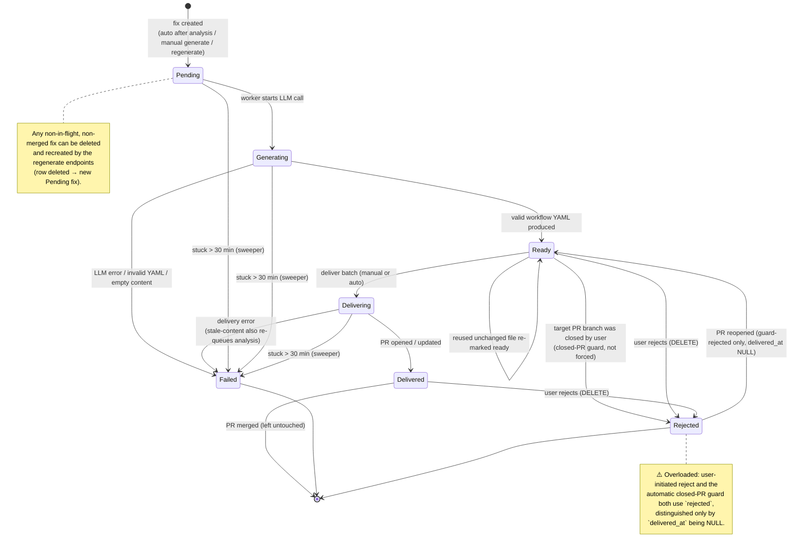
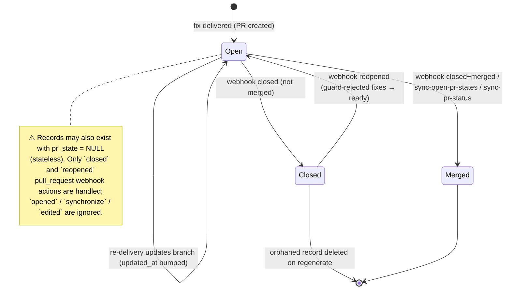

# GreenSecOps — Workflow State Machines

This document models how the four core entities move through their lifecycles:
**Analysis**, **Issue**, **Fix**, and **Pull Request**. Each machine lists the
**incoming events / data** that drive its transitions (GitHub webhooks, API
calls, Celery beat schedules, worker outcomes) and a **⚠️ Missing states /
transitions** section capturing gaps to fix later.

State is persisted in Postgres:

- `Analysis.status` → `AnalysisStatus`
- `Issue` has **no status column**; its lifecycle is derived from `resolved_at`
  (null = open) and `fix_id` (linked to a fix or not).
- `Fix.status` → `FixStatus`
- `PullRequest.pr_state` → `PullRequestState` (nullable)

> Legend: solid transitions exist in code today. Transitions/states annotated
> with **⚠️** are gaps — either an enum value that is never persisted, or a
> real-world transition the system does not yet handle.

---

## 0. Pipeline Overview

How the entities chain together, and where external events enter.

---

## 1. Analysis

`AnalysisStatus`: `pending`, `running`, `completed`, `failed`, `skipped`,
`no_workflows`. Driven by `app/workers/tasks/static_analysis.py`.

### Incoming events / data

| Source | Trigger | `AnalysisTrigger` | Notes |
|---|---|---|---|
| webhook `push` | touches `.github/workflows/**` or new branch | `webhook_push` | repo must be `enabled`; skips `greensecops/*` branches |
| webhook `workflow_run` | `action == completed` | `webhook_workflow_run` | repo must be `enabled` |
| webhook `issue_comment` | body `/greensecops reanalyze` | `manual` | `force=True` |
| REST `POST /analyses/trigger/{repo}` | user | `manual` | `force=True` default, quota-checked |
| REST `POST /analyses/reanalyze-all` | superuser | `release` | fans out to all enabled repos |
| `installation_sync` | first sync of a never-analyzed repo | `manual` | initial analysis on install |
| Celery beat `nightly-reanalysis` | 03:17 UTC | `scheduled` | `force=False` (content dedup keeps it cheap) |
| version ship / `reanalyze_all(force=True)` | release | `release` | re-applies new rules |
| `fix_delivery` stale-content error | delivery detected drift | `manual` | `force=True`, re-analyze then retry |

### State machine

### ⚠️ Missing states / transitions

1. **`pending` never persisted.** The queued phase is SSE-only; the worker
   inserts `running` directly. The stuck-sweeper still looks for `pending`
   rows that can never exist.
2. **`skipped` never persisted.** Duplicate detection references the prior
   analysis instead of writing a `skipped` row, so the enum value is dead.
3. **No terminal "retries exhausted" state** distinct from `failed` — a
   transient fetch failure that exhausts retries and a hard OPA failure both
   land in `failed`.
4. **Dynamic analysis is disconnected.** `run_dynamic_analysis` is never
   called from telemetry ingest, and its computed enrichments are only logged,
   never attached to an `Analysis` or surfaced as issues.

---

## 2. Issue

Issues have **no status enum**. Lifecycle is derived from two columns:
`resolved_at` (null ⇒ open) and `fix_id` (linked to a fix or not). Managed in
`static_analysis.py` (`_resolve_stale_issues`,
`_resolve_issues_for_missing_files`, the upsert) and the fix routes.

### Incoming events / data

| Source | Effect |
|---|---|
| analysis upsert (new violation) | insert Open issue (`resolved_at=NULL`) |
| analysis upsert (recurring violation) | reopen: `resolved_at → NULL` on the existing row |
| analysis: violation absent in latest run | resolve stale issue (user fixed it, or rule disabled/removed) |
| analysis: workflow file deleted/renamed | resolve all its open issues |
| fix generation queued | link issue → fix (`fix_id` set) |
| fix deleted / regenerated | unlink (`fix_id → NULL` via `ON DELETE SET NULL`) |

### State machine

### ⚠️ Missing states / transitions

1. **No "ignored / muted / accepted-risk" state.** The `/greensecops ignore`
   command is parsed but explicitly *not implemented*, and there is no API to
   suppress an issue. A user cannot dismiss a false positive.
2. **"Resolved" is overloaded.** Resolved-by-user-fix, resolved-because-merged,
   and resolved-because-rule-disabled are indistinguishable — no reason is
   recorded on `resolved_at`.
3. **No explicit "fixed & merged" terminal.** When a fix's PR merges, the issue
   is only resolved on the *next* analysis of the default branch, not
   immediately on merge.

---

## 3. Fix

`FixStatus`: `pending`, `generating`, `ready`, `delivering`, `delivered`,
`failed`, `rejected`. Driven by `fix_generation.py`, `fix_delivery.py`, and
`api/routes/fixes.py`.

### Incoming events / data

| Source | Effect |
|---|---|
| analysis completes + `auto_fix_enabled` | `_auto_queue_fix_generation` creates pending fixes |
| REST `generate-for-repo` / `regenerate-for-repo` / `regenerate-for-workflow` | create pending fixes (delete+recreate) |
| worker `run_fix_generation` | `pending → generating → ready \| failed` |
| REST `deliver-for-repo` / `deliver-for-workflow`, or auto-deliver | `ready → delivering` |
| worker `deliver_fixes_batch` | `delivering → delivered \| failed`; or `ready → rejected` (closed-PR guard) |
| REST `DELETE /fixes/{id}` | any → `rejected` |
| webhook `pull_request` reopened | guard-`rejected` (delivered_at NULL) → `ready` |
| Celery beat sweeper | `pending`/`generating`/`delivering` stuck > 30 min → `failed` |

### State machine

### ⚠️ Missing states / transitions

1. **`rejected` is two different states** (user reject vs. closed-PR guard),
   disambiguated only by an implicit `delivered_at IS NULL` convention.
2. **`failed` is terminal with no auto-recovery** — a transient LLM/delivery
   failure requires a manual regenerate; there is no automatic retry path back
   to `pending`.
3. **`fix.skipped` is SSE-only**, never a persisted status (emitted when the
   worker finds no pending row).
4. **No transition when a *delivered* PR is closed without merging.** The PR
   record flips to `closed`, but the delivered fix keeps `delivered`, so the UI
   shows a delivered fix whose code never landed.
5. **Comment delivery mode is unimplemented.** `FixDeliveryMode.comment` and
   `PullRequest.comment_url` exist, but delivery only ever opens a PR
   (`comment` falls through to PR behavior; only `disabled` short-circuits).

---

## 4. Pull Request

`PullRequestState`: `open`, `merged`, `closed` (column is nullable — stateless
records can carry `NULL`). Driven by `fix_delivery.py`, the `pull_request`
webhook, and the PR-sync maintenance task / API.

### Incoming events / data

| Source | Effect |
|---|---|
| `deliver_fixes_batch` success | create/update record, `pr_state = open` |
| re-delivery on same branch | update `pr_url`, bump `updated_at` (stays `open`) |
| webhook `pull_request` `closed` + `merged` | `open → merged` |
| webhook `pull_request` `closed` (not merged) | `open → closed` |
| webhook `pull_request` `reopened` | `closed → open` (+ guard-rejected fixes → ready) |
| Celery beat `sync-open-pr-states` (every 6h) | reconcile missed webhooks: `open → merged/closed` |
| REST `POST /fixes/sync-pr-status/{repo}` | on-demand reconcile |
| `regenerate-*` (orphaned closed record) | record deleted |

### State machine

### ⚠️ Missing states / transitions

1. **Only `closed` / `reopened` webhook actions are handled.** A user pushing
   to the PR branch (`synchronize`), or edits to the PR, are not tracked —
   GreenSecOps may hard-reset those commits on the next delivery.
2. **`NULL` (stateless) records exist** alongside the three real states,
   complicating every `pr_state` query (handled ad-hoc with `IS NULL` arms).
3. **No CI / review / merge-conflict states.** The PR's check status, review
   decision, and mergeability are never modeled, so delivery can't react to a
   red PR or a conflicting branch.
4. **No draft state** and no representation of the (unimplemented) inline
   `comment` delivery channel.

---

## Cross-cutting: Repository / Installation gating

Every machine above is gated by repository flags that are themselves driven by
webhooks. Not a persisted state machine, but the inputs matter:

| Event | Effect on `Repository` |
|---|---|
| webhook `installation` `created` / `unsuspend` | sync repos, mark accessible |
| webhook `installation` `deleted` / `suspend` | mark all repos `is_accessible = False` |
| webhook `installation_repositories` `added` / `removed` | toggle repo accessibility / disable |
| webhook `repository` `archived` / `deleted` | `enabled = False`, `is_accessible = False` |
| webhook `repository` `unarchived` | re-enable |
| webhook `repository` `renamed` / `transferred` | update `full_name` / `default_branch` |

`enabled` gates analysis triggers; `is_accessible` + `installation_id` gate fix
delivery. These are the main "other incoming data" that silently change how the
four machines behave.
