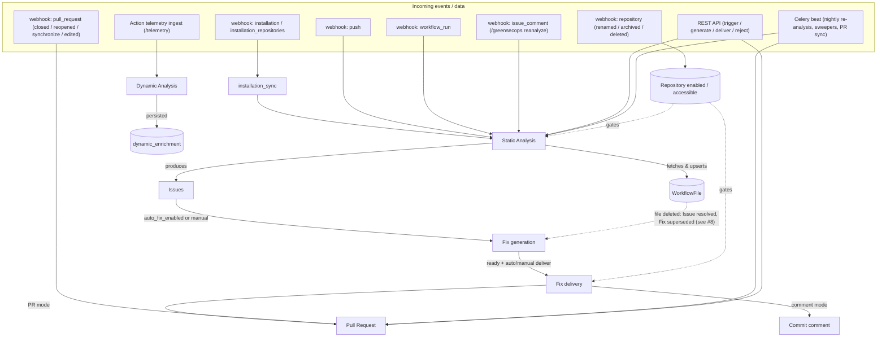
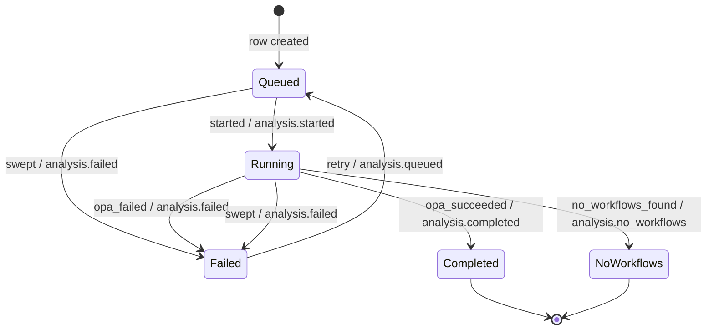
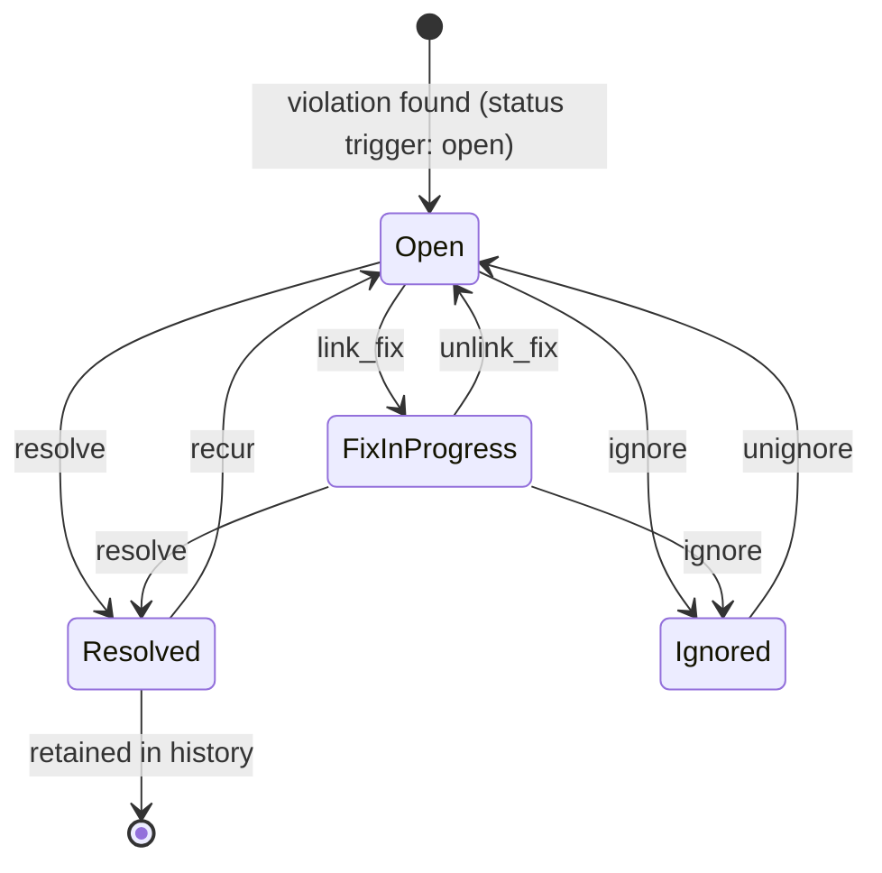
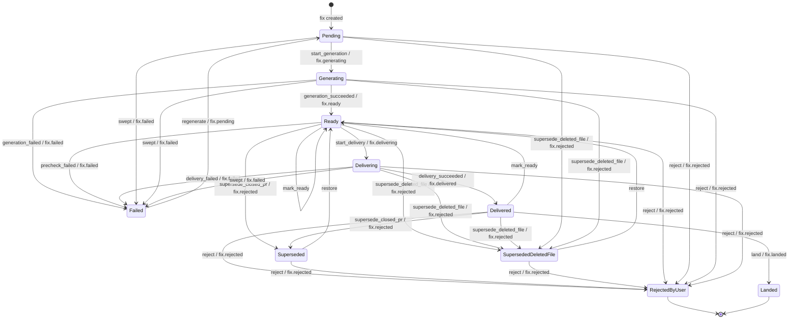
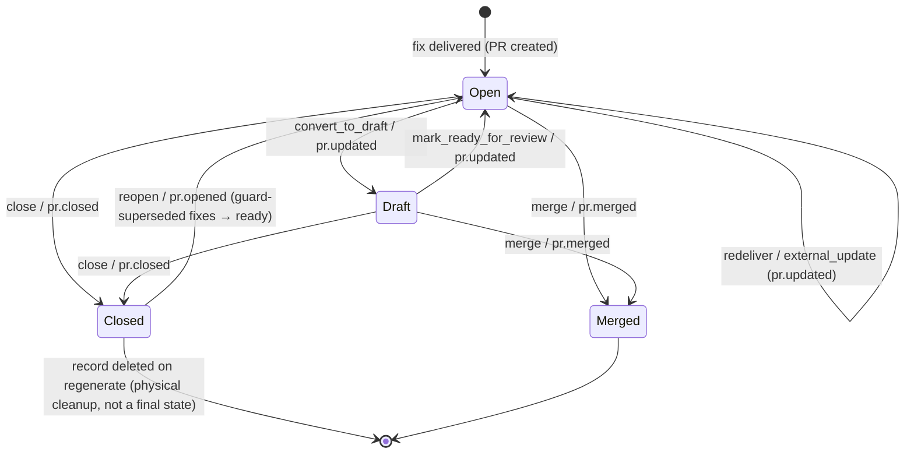
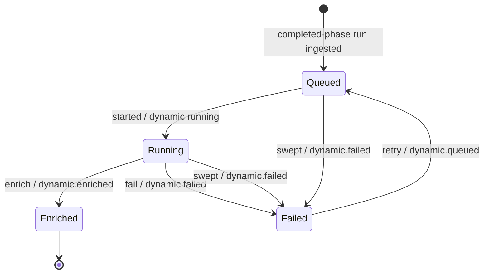
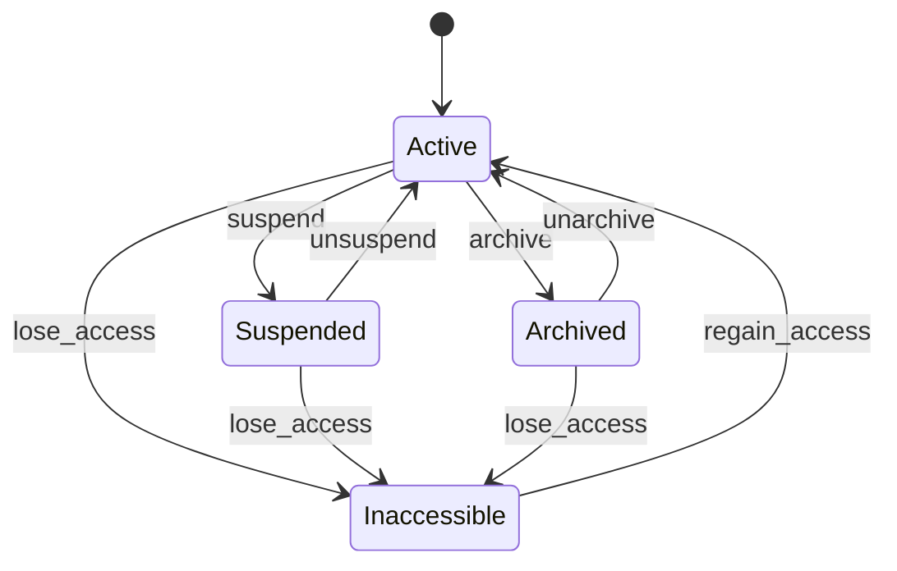

# GreenSecOps — Workflow State Machines

This document formalizes the six core lifecycles — **Analysis**, **Issue**,
**Fix**, **Pull Request**, **Repository** and **Telemetry (dynamic analysis)** —
as state machines: their **states**, the **input events** that drive
transitions, and the **outputs** (SSE signals) each transition emits. It is kept
in sync with the code in
[`backend/app/services/state_machines/`](../backend/app/services/state_machines),
which is the single source of truth.

## Formalization in code

Each lifecycle is a [`python-statemachine`](https://pypi.org/project/python-statemachine/)
`StateMachine` subclass (`analysis.py`, `fix.py`, `pull_request.py`,
`issue.py`, `repository.py`, `telemetry.py`). States carry the persisted
status-enum value they map to; events declare the transitions; a per-machine
`outputs` map records the `SSESignal` each event emits.

| Concept | In code |
|---|---|
| **State** | `State(value=<StatusEnum>.x, final=…)` — the persisted column value |
| **Input event** | a `<source>.to(<dest>)` transition method on the machine |
| **Output** | `Machine.outputs[event]` → the `SSESignal` emitted when it fires |

The library enforces a **single connected graph** with **one initial state**;
states with no outgoing edge must be `final`. Call sites never assign status
directly — they go through thin helpers in `base.py` so an illegal transition
raises instead of corrupting state:

```python
from app.services import state_machines as sm

sm.advance(fix, sm.FixMachine, "start_generation")      # raises on illegal transition
sm.try_advance(pr, sm.PullRequestMachine, "reopen")     # idempotent no-op at webhook boundaries
sm.force_to(fix, sm.FixMachine, FixStatus.delivering)   # admin override (forced delivery)
```

- **`advance`** — validates the source state and fires, else raises
  `IllegalTransition`. Normal worker/API paths.
- **`try_advance`** — fires only if legal, else returns `False`. Boundaries
  where GitHub may **redeliver or reorder** events, and it leaves a `NULL`
  legacy state column untouched (no auto-initialisation).
- **`force_to`** — sets the destination directly, bypassing the source guard,
  for explicit administrator overrides (forced fix delivery).

> This document reflects the **closed-gap** behaviour. Each machine ends with
> what was **closed** in the formalization pass and what remains **open**.

---

## 0. Pipeline Overview



---

## 1. Analysis

- **States** — `AnalysisStatus`: `queued`, `running`, `completed`, `failed`,
  `no_workflows`
- **Events** — `started`, `opa_succeeded`, `opa_failed`, `no_workflows_found`,
  `swept`, `retry`
- **Code** — `state_machines/analysis.py`; `workers/tasks/static_analysis.py`,
  `maintenance.py`
- **Initial** — `queued`. **Final** — `completed`, `no_workflows` (`failed` is
  retryable, not final).

Rows are inserted as `queued` and advance to `running` (`started`) when the
worker begins OPA evaluation, so a row that dies before the worker starts is
distinguishable (still `queued`) from one that hangs mid-eval (`running`) — the
sweeper covers both.

### Transitions (input → output)

| Event | From → To | Output (SSE) | Guard |
|---|---|---|---|
| `started` | `queued` → `running` | `analysis.started` | worker begins OPA eval |
| `opa_succeeded` | `running` → `completed` | `analysis.completed` | OPA eval produced a score |
| `opa_failed` | `running` → `failed` | `analysis.failed` | OPA eval raised |
| `no_workflows_found` | `running` → `no_workflows` | `analysis.no_workflows` | repo has no workflow files |
| `swept` | `queued`, `running` → `failed` | `analysis.failed` | `created_at` older than 30 min |
| `retry` | `failed` → `queued` | `analysis.queued` | re-queue a (transient) failure in place |

The `failure_kind` column (`transient` / `permanent`) records whether a failure
is retry-worthy: OPA timeouts and network/IO errors are `transient`, a swept row
is `transient`, and parse/value errors (invalid workflow YAML) are `permanent`.

### External triggers

| Source | `AnalysisTrigger` |
|---|---|
| webhook `push` (touches `.github/workflows/**` or new branch) | `webhook_push` |
| webhook `workflow_run` (`completed`) | `webhook_workflow_run` |
| webhook `issue_comment` (`/greensecops reanalyze`) / REST trigger | `manual` |
| `reanalyze-all`, version ship | `release` |
| `installation_sync` (first sync) | `manual` |
| Celery beat `nightly-reanalysis` | `scheduled` |
| `fix_delivery` stale-content error | `manual` |

### State machine



**Closed in this pass:** a `queued` initial state models the worker-pickup phase
so `analysis.started` maps to a real transition and the sweeper distinguishes
never-started from hung rows; the never-persisted `pending`/`skipped` values are
gone; a `failure_kind` attribute distinguishes transient from permanent failures
and a `retry` edge re-queues a failed row in place (`failed` is no longer
terminal); dynamic analysis is a formal machine (§6).

**Still open:** the broker-queue window *before* the worker picks the task up is
still SSE-only (a per-row `queued` would need a parent "analysis run" entity);
in-place row-reuse on `retry` awaits a per-row worker — today users re-run via
the repo-level `POST /analyses/trigger/{repo_id}`.

---

## 2. Issue

`Issue.status` is a **persisted, indexed column** (`IssueStatus`) maintained by
a database trigger that computes it from `ignored_at` + `resolved_at` + `fix_id`
(migrations `0022`/`0026`). The trigger keeps it authoritative even when `fix_id`
is cleared by the `ON DELETE SET NULL` cascade on fix deletion — which bypasses
application code — so the column can never disagree with the underlying fields.
The machine therefore documents and validates the legal field-level
transitions; the trigger owns writes.

- **States** — `IssueStatus`: `open`, `fix_in_progress`, `resolved`, `ignored`
- **Events** — `link_fix`, `unlink_fix`, `resolve`, `recur`, `ignore`,
  `unignore`
- **Code** — `state_machines/issue.py`; trigger in migrations `0022`/`0026`;
  `api/routes/issues.py` (`/ignore`, `/unignore`), `/greensecops ignore
  <fingerprint>` comment command in the webhook handler

`ignored` takes precedence in the trigger: a muted violation reads `ignored`
regardless of fix/resolve activity, and drops out of the default (active) issue
and fix-generation queries.

### Transitions

| Event | From → To | Underlying field change |
|---|---|---|
| `link_fix` | `open` → `fix_in_progress` | `fix_id` set |
| `unlink_fix` | `fix_in_progress` → `open` | `fix_id` → `NULL` (fix deleted) |
| `resolve` | `open`, `fix_in_progress` → `resolved` | `resolved_at` set |
| `recur` | `resolved` → `open` | `resolved_at` → `NULL` |
| `ignore` | `open`, `fix_in_progress` → `ignored` | `ignored_at` set |
| `unignore` | `ignored` → `open` | `ignored_at` → `NULL` |



**Closed in this pass:** an `ignored` state implements `/greensecops ignore`
(and a REST `/ignore` endpoint), letting users mute false positives / accepted
risk; the status is a real persisted column with `ignored_at` precedence; a
`resolution_reason` attribute (`no_longer_detected` / `file_removed` / `merged`)
records *why* an issue resolved, set alongside `resolved_at` and cleared on
recur.

**Still open:** `no_longer_detected` conflates a manual fix with a
disabled/removed rule — the two are not distinguishable after re-analysis.

---

## 3. Fix

- **States** — `FixStatus`: `pending`, `generating`, `ready`, `delivering`,
  `delivered`, `failed`, `rejected_by_user`, `superseded_by_closed_pr`,
  `superseded_by_deleted_file`, `landed`
- **Events** — `start_generation`, `generation_succeeded`, `generation_failed`,
  `mark_ready`, `start_delivery`, `precheck_failed`, `delivery_succeeded`,
  `delivery_failed`, `supersede_closed_pr`, `supersede_deleted_file`, `reject`,
  `restore`, `regenerate`, `land`, `swept`
- **Code** — `state_machines/fix.py`; `fix_generation.py`, `fix_delivery.py`,
  `api/routes/fixes.py`, `maintenance.py`, the `pull_request` webhook handler,
  `static_analysis.py` (`_resolve_issues_for_missing_files`)
- **Initial** — `pending`. **Final** — `rejected_by_user`, `landed` (`failed`
  is no longer final — `regenerate` retries it in place).

The two withdrawal-by-the-system states sit alongside the one user rejection
(no longer disambiguated by a `delivered_at IS NULL` convention):

- `rejected_by_user` — a human dismissed the fix; **terminal**. A repeated
  DELETE is made idempotent at the endpoint via `try_advance`, not a self-loop.
- `superseded_by_closed_pr` — the closed-PR delivery guard auto-rejected it;
  `restore` makes it deliverable again when the PR is reopened.
- `superseded_by_deleted_file` — the workflow file this fix targets was
  deleted from the repo (detected during missing-file reconciliation, see
  §8); `restore` makes it deliverable again if a later push re-adds the same
  path.

### Transitions (input → output)

| Event | From → To | Output (SSE) | Guard |
|---|---|---|---|
| `start_generation` | `pending` → `generating` | `fix.generating` | worker picked up |
| `generation_succeeded` | `generating` → `ready` | `fix.ready` | valid workflow YAML |
| `generation_failed` | `generating` → `failed` | `fix.failed` | LLM error / invalid / empty |
| `mark_ready` | `ready`, `delivered` → `ready` | — | unchanged file re-included |
| `start_delivery` | `ready` → `delivering` | `fix.delivering` | (bypassed under `force`) |
| `precheck_failed` | `ready` → `failed` | `fix.failed` | fix has no content |
| `delivery_succeeded` | `delivering` → `delivered` | `fix.delivered` | PR opened / comment posted |
| `delivery_failed` | `delivering` → `failed` | `fix.failed` | push / PR / comment error |
| `supersede_closed_pr` | `ready`, `delivered` → `superseded_by_closed_pr` | `fix.rejected` | target PR branch closed, not forced / a delivered PR closed unmerged |
| `supersede_deleted_file` | `pending`, `generating`, `ready`, `delivering`, `delivered` → `superseded_by_deleted_file` | `fix.rejected` | fix's workflow file missing from the latest push's fetched paths |
| `reject` | any non-terminal → `rejected_by_user` | `fix.rejected` | user DELETE |
| `restore` | `superseded_by_closed_pr`, `superseded_by_deleted_file` → `ready` | — | PR reopened / workflow file path reappears |
| `regenerate` | `failed` → `pending` | `fix.pending` | user retries a failed fix in place |
| `land` | `delivered` → `landed` | `fix.landed` | the fix's PR was merged |
| `swept` | `pending`, `generating`, `delivering` → `failed` | `fix.failed` | stuck > 30 min |



**Closed in this pass:** `supersede_closed_pr` now also fires from `delivered`,
so a delivered PR closed without merging withdraws its fix (restored on reopen)
instead of stranding it; a `regenerate` edge (`failed` → `pending`) retries a
failed fix in place, so `failed` is no longer terminal; a `land` edge
(`delivered` → `landed`) fired from the PR-merge webhook gives a merged fix a
terminal success state and resolves its issues with reason `merged`;
`supersede_deleted_file` (§8) withdraws a fix whose target workflow file was
deleted from the repo, from any non-terminal state, and `restore` brings it
back if the path reappears — closing the fix half of the deleted-workflow-file
gap.

**Still open:** the `fix.skipped` SSE signal has no persisted status (dedup
avoids row bloat — intentional).

---

## 4. Pull Request

- **States** — `PullRequestState`: `open`, `draft`, `merged`, `closed` (column
  is `NOT NULL DEFAULT 'open'` since migration `0027`; legacy `NULL` rows were
  backfilled to `open`)
- **Events** — `redeliver`, `external_update`, `convert_to_draft`,
  `mark_ready_for_review`, `merge`, `close`, `reopen`
- **Attributes** (not states) — `ci_status`, `review_decision`,
  `mergeable_state`, populated by `check_suite` / `pull_request_review` /
  `pull_request` webhooks (migration `0030`)
- **Code** — `state_machines/pull_request.py`; `fix_delivery.py`, the
  `pull_request` webhook, `maintenance.sync_open_pr_states`,
  `fixes.sync_pr_statuses`
- **Initial** — `open`. **Final** — `merged`.

Genuine lifecycle transitions (`merge`, `close`, `reopen`) go through the
machine with `try_advance` at the webhook/reconcile boundaries. PR creation and
the "ensure open on re-delivery" reconciliation happen at the delivery boundary
as initialisation.

### Transitions (input → output)

| Event | From → To | Output (SSE) | Source |
|---|---|---|---|
| `redeliver` | `open` → `open` | `pr.updated` | a later delivery updated the branch |
| `external_update` | `open` → `open` | `pr.updated` | webhook `synchronize` / `edited` |
| `convert_to_draft` | `open` → `draft` | `pr.updated` | webhook `converted_to_draft` |
| `mark_ready_for_review` | `draft` → `open` | `pr.updated` | webhook `ready_for_review` |
| `merge` | `open`, `draft` → `merged` | `pr.merged` | webhook `closed`+merged / reconcile |
| `close` | `open`, `draft` → `closed` | `pr.closed` | webhook `closed` (not merged) / reconcile |
| `reopen` | `closed` → `open` | `pr.opened` | webhook `reopened` |



**Closed in this pass:** `synchronize` and `edited` webhook actions are handled
via `external_update`; legacy `NULL` `pr_state` rows were backfilled to `open`
and the column is now `NOT NULL` (migration `0027`); a first-class `draft` state
tracks GitHub's `converted_to_draft` / `ready_for_review`; and CI outcome,
review decision and mergeable-state are captured as **attributes** (via
`check_suite` and `pull_request_review` webhooks) rather than as extra states,
keeping the core graph small.

**Still open:** CI/review are single-value attributes, not a full check-run
history; no explicit `conflicted` state (surfaced through `mergeable_state`).

---

## 5. Fix delivery modes

`FixDeliveryMode` selects how a ready fix reaches the repo:

| Mode | Behaviour |
|---|---|
| `pr` (default) | open/update a PR on a `greensecops/…` branch (§4) |
| `comment` | post the suggested changes as a **commit comment** on the base branch HEAD; the comment URL is stored on a per-repo record the fixes link to and surfaced as `FixPublic.comment_url` |
| `disabled` | delivery is skipped |

**Closed in this pass:** `comment` mode is implemented (it previously fell
through to PR delivery).

---

## 6. Dynamic analysis (runtime telemetry) — `TelemetryMachine`

The companion Action posts runtime telemetry to `/telemetry/ingest`. `phase`
(`started` / `completed`) is an ingest *category* — the two are separate rows —
so the dynamic-analysis lifecycle is a **separate** `dynamic_status` column
(migration `0032`) driven by `TelemetryMachine`. A `completed`-phase row is
created `queued` at ingest, which enqueues `run_dynamic_analysis`; the worker
evaluates the metrics (e.g. an oversized runner) and **persists** findings to
`dynamic_enrichment` (migration `0025`).

- **States** — `DynamicAnalysisStatus`: `queued`(init), `running`, `enriched`
  (final), `failed`
- **Events** — `started`, `enrich`, `fail`, `retry`, `swept`
- **Code** — `state_machines/telemetry.py`; `api/routes/telemetry.py`,
  `workers/tasks/dynamic_analysis.py`, `maintenance.py`
  (`sweep_stuck_states`)

| Event | From → To | Output (SSE) |
|---|---|---|
| `started` | `queued` → `running` | `dynamic.running` |
| `enrich` | `running` → `enriched` | `dynamic.enriched` |
| `fail` | `running` → `failed` | `dynamic.failed` |
| `retry` | `failed` → `queued` | `dynamic.queued` |
| `swept` | `queued`, `running` → `failed` | `dynamic.failed` |



**Closed in this pass:** the dynamic-analysis lifecycle is now a formal machine
with `enriched` / `failed` states (the worker previously wrote no status and let
failures bubble); `started`-phase rows keep `dynamic_status` NULL;
`maintenance.sweep_stuck_states` now also sweeps stuck `queued`/`running` rows
(`collected_at` older than the same 30-minute cutoff used for Analysis/Fix,
since `TelemetryRun` has no `updated_at`) to `failed` via `swept`, so a crashed
`run_dynamic_analysis` worker no longer leaves the row stuck indefinitely.

**Still open:** surfacing the persisted enrichments through the API / UI.

---

## 7. Repository accessibility / lifecycle — `RepositoryMachine`

Repository *accessibility* is now a formal machine over a `status` column
(migration `0031`) rather than an ad-hoc boolean. `is_accessible` is a
machine-synced cache of `status == active`, so the existing write-gates are
unchanged. `enabled` (user opt-in) and `is_external` stay independent flags —
they are a genuinely separate axis (a user can disable an accessible repo).

- **States** — `RepositoryStatus`: `active`(init), `suspended`, `archived`,
  `inaccessible`
- **Events** — `suspend`, `unsuspend`, `archive`, `unarchive`, `lose_access`,
  `regain_access`
- **Code** — `state_machines/repository.py`; the
  `installation`/`installation_repositories`/`repository` webhook handlers and
  `crud.py`

| Event | From → To | Output (SSE) | Cause |
|---|---|---|---|
| `suspend` | `active` → `suspended` | `repository.suspended` | installation suspended |
| `unsuspend` | `suspended` → `active` | `repository.restored` | installation unsuspended |
| `archive` | `active` → `archived` | `repository.archived` | repo archived on GitHub |
| `unarchive` | `archived` → `active` | `repository.restored` | repo unarchived |
| `lose_access` | `active`/`suspended`/`archived` → `inaccessible` | `repository.inaccessible` | installation deleted / repo removed |
| `regain_access` | `inaccessible` → `active` | `repository.restored` | repo re-added |



`enabled` gates analysis triggers; `is_accessible` (≡ `status == active`) +
`installation_id` gate fix delivery. `repository` `renamed` / `transferred`
webhooks update `full_name` / `default_branch` without a status change.

**Closed in this pass:** the accessibility axis is a formal machine with
per-cause SSE signals; the old asymmetry (unsuspend restored `is_accessible` but
not `enabled`) is now explicit — `enabled` is deliberately a separate user-owned
flag, left untouched by accessibility transitions.

---

## 8. Workflow File (existence tracking, not a lifecycle)

`WorkflowFile` rows are not modeled as a state machine — a workflow file
either currently exists at a path in the repo or it doesn't; there is no
persisted `status` column. Analysis upserts a row per path (keyed by
`content_hash`) on every fetch. Three downstream entities point at a
`workflow_file_id`: `Analysis`, `Issue` (via `Analysis`), and `Fix`.

### What already happens on deletion

A push webhook that touches `.github/workflows/**` (a `removed` entry counts)
always re-fetches the **full** workflow set, never a single
`workflow_file_id`, so `_resolve_issues_for_missing_files`
(`static_analysis.py`) diffs the fetched paths against existing
`WorkflowFile` rows for the repo and resolves every open `Issue` on a path
that's gone, with `resolution_reason=file_removed`.

### The gap (closed for Fix; deliberately not for the row itself)

`_auto_queue_fix_generation` (`static_analysis.py`) only reconciles `Fix`
rows for workflow files that have currently **open** issues in the latest
completed analysis. A deleted file has none by the time reconciliation runs
(its issues were just resolved above), so its `workflow_file_id` never used
to appear in that target set — the existing `Fix` row, in *any* state
(`ready`, `delivering`, `delivered`, …), was silently skipped.

`_resolve_issues_for_missing_files` now also withdraws the fix directly: for
every `WorkflowFile` whose path dropped out of `fetched_paths`, if it has a
non-terminal `Fix`, `FixMachine`'s `supersede_deleted_file` event (§3) fires
via `try_advance` — moving it to `superseded_by_deleted_file` regardless of
which non-terminal state it was in. Symmetrically, when an existing
`WorkflowFile` row is matched by path again (the file reappeared), `restore`
fires on its fix if superseded. This closes:

- **Not transitioned** — now has a dedicated event instead of silently
  skipping.
- **Not cleaned up** — a superseded fix is excluded from the "active fix"
  filter (`REJECTED_STATUSES`, `fix.py:29`) the same way a user-rejected one
  is, so it can't be manually delivered or ride along in a batch.
- **PR left stale** — a `delivered` fix withdrawn this way stops being
  re-included by the batch reset-and-reapply flow (§3), so its next
  redelivery correctly drops the file.

**Row never dies** is left open on purpose: `Issue.workflow_file_id` and
`Fix.workflow_file_id` are both `ondelete="CASCADE"` on `WorkflowFile`.
Physically deleting a `WorkflowFile` row to reclaim space would cascade-delete
every `Issue` ever raised against it — including ones resolved with
`resolution_reason=file_removed` — destroying audit history for a cosmetic
row-count cleanup. Orphaned `WorkflowFile` rows are inert text blobs, not a
correctness problem, so they're left in place; only a full `Repository`
delete cascades them away.
