# GreenSecOps — Workflow State Machines

This document formalizes the core lifecycles — **Analysis**, **Issue**,
**Fix**, **Pull Request**, **Repository**, **Telemetry (dynamic analysis)**,
the IaC/cloud-posture engines' **Scan**, **Finding**, and **Cloud Account**,
the **Billing Subscription**, and the derived **Target activity** that decides
which actions an engine target will accept — as state machines: their
**states**, the **input events** that drive transitions, and the **outputs**
(SSE signals) each transition emits.
It is kept in sync with the code in
[`backend/app/services/state_machines/`](../backend/app/services/state_machines),
which is the single source of truth.

## Formalization in code

Each lifecycle is a [`python-statemachine`](https://pypi.org/project/python-statemachine/)
`StateMachine` subclass (`analysis.py`, `fix.py`, `pull_request.py`,
`issue.py`, `repository.py`, `telemetry.py`, `scan.py`, `finding.py`,
`cloud_account.py`, `billing.py`). States carry the persisted status-enum value they map
to; events declare the transitions; a per-machine `outputs` map records the
`SSESignal` each event emits.

| Concept | In code |
|---|---|
| **State** | `State(value=<StatusEnum>.x, final=…)` — the persisted column value |
| **Input event** | a `<source>.to(<dest>)` transition method on the machine |
| **Output** | `Machine.outputs[event]` → the `SSESignal` emitted when it fires |

The library enforces a **single connected graph** with **one initial state**;
states with no outgoing edge must be `final`. Call sites never assign status
directly — they go through thin helpers in `base.py` so an illegal transition
raises instead of corrupting state:

```python
from app.services import state_machines as sm

sm.advance(fix, sm.FixMachine, "start_generation")      # raises on illegal transition
sm.try_advance(pr, sm.PullRequestMachine, "reopen")     # idempotent no-op at webhook boundaries
sm.force_to(fix, sm.FixMachine, FixStatus.delivering)   # admin override (forced delivery)
```

- **`advance`** — validates the source state and fires, else raises
  `IllegalTransition`. Normal worker/API paths.
- **`try_advance`** — fires only if legal, else returns `False`. Boundaries
  where GitHub may **redeliver or reorder** events, and it leaves a `NULL`
  legacy state column untouched (no auto-initialisation).
- **`force_to`** — sets the destination directly, bypassing the source guard,
  for explicit administrator overrides (forced fix delivery).

> This document reflects the **closed-gap** behaviour. Each machine ends with
> what was **closed** in the formalization pass and what remains **open**.

---

## 0. Pipeline Overview

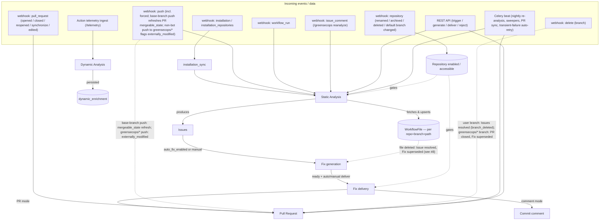

---

## 1. Analysis

- **States** — `AnalysisStatus`: `queued`, `running`, `completed`, `failed`,
  `no_workflows`
- **Events** — `started`, `opa_succeeded`, `opa_failed`, `no_workflows_found`,
  `swept`, `retry`
- **Code** — `state_machines/analysis.py`; `workers/tasks/static_analysis.py`,
  `maintenance.py`
- **Initial** — `queued`. **Final** — `completed`, `no_workflows` (`failed` is
  retryable, not final).

Rows are inserted as `queued` and advance to `running` (`started`) when the
worker begins OPA evaluation, so a row that dies before the worker starts is
distinguishable (still `queued`) from one that hangs mid-eval (`running`) — the
sweeper covers both.

### Transitions (input → output)

| Event | From → To | Output (SSE) | Guard |
|---|---|---|---|
| `started` | `queued` → `running` | `analysis.started` | worker begins OPA eval |
| `opa_succeeded` | `running` → `completed` | `analysis.completed` | OPA eval produced a score |
| `opa_failed` | `running` → `failed` | `analysis.failed` | OPA eval raised |
| `no_workflows_found` | `running` → `no_workflows` | `analysis.no_workflows` | repo has no workflow files |
| `swept` | `queued`, `running` → `failed` | `analysis.failed` | `created_at` older than 30 min |
| `retry` | `failed` → `queued` | `analysis.queued` | re-queue a (transient) failure in place |

The `failure_kind` column (`transient` / `permanent`) records whether a failure
is retry-worthy: OPA timeouts and network/IO errors are `transient`, a swept row
is `transient`, and parse/value errors (invalid workflow YAML) are `permanent`.

### External triggers

| Source | `AnalysisTrigger` |
|---|---|
| webhook `push` (touches `.github/workflows/**`, new branch, or **forced** — a rebase can change workflow content without listing workflow paths) | `webhook_push` |
| webhook `workflow_run` (`completed`) | `webhook_workflow_run` |
| webhook `issue_comment` (`/greensecops reanalyze`) / REST trigger | `manual` |
| webhook `repository` (`edited`, default branch changed → analyse the new default branch) | `manual` |
| `reanalyze-all`, version ship | `release` |
| `installation_sync` (first sync) | `manual` |
| Celery beat `nightly-reanalysis` | `scheduled` |
| Celery beat `retry-transient-analyses` (hourly, re-runs recent `failed`+`transient` rows; ≤3 attempts per content hash) | `scheduled` |
| `fix_delivery` stale-content error | `manual` |

Analyses run **per branch**: content dedup and the WorkflowFile upsert are
scoped to (repo, branch), so identical content on two branches is analysed
independently and a feature-branch run can never touch default-branch state.

### State machine

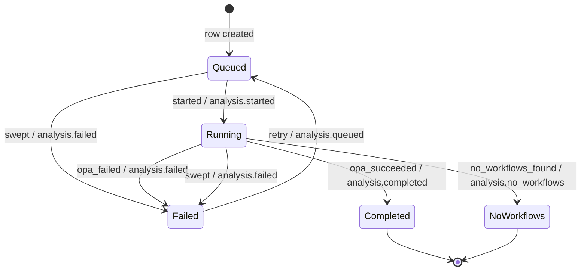

**Closed in this pass:** a `queued` initial state models the worker-pickup phase
so `analysis.started` maps to a real transition and the sweeper distinguishes
never-started from hung rows; the never-persisted `pending`/`skipped` values are
gone; a `failure_kind` attribute distinguishes transient from permanent failures
and a `retry` edge re-queues a failed row in place (`failed` is no longer
terminal); dynamic analysis is a formal machine (§6).

**Still open:** the broker-queue window *before* the worker picks the task up is
still SSE-only (a per-row `queued` would need a parent "analysis run" entity);
in-place row-reuse on `retry` awaits a per-row worker — today users re-run via
the repo-level `POST /workflow/repositories/{repo_id}/scans` or, for a single
workflow file, `POST /workflow/files/{workflow_file_id}/scans` (the worker
already accepts a `workflow_file_id` and scopes the run to that file's own
branch), and the `retry-transient-analyses` beat re-runs transient failures at
repo/branch scope with fresh rows (it deliberately does **not** fire `retry` on
the old row, which would only be swept back to `failed`).

---

## 2. Issue

`Issue.status` is a **persisted, indexed column** (`IssueStatus`) maintained by
a database trigger that computes it from `ignored_at` + `resolved_at` + `fix_id`
(migrations `0022`/`0026`). The trigger keeps it authoritative even when `fix_id`
is cleared by the `ON DELETE SET NULL` cascade on fix deletion — which bypasses
application code — so the column can never disagree with the underlying fields.
The machine therefore documents and validates the legal field-level
transitions; the trigger owns writes.

- **States** — `IssueStatus`: `open`, `fix_in_progress`, `resolved`, `ignored`
- **Events** — `link_fix`, `unlink_fix`, `resolve`, `recur`, `ignore`,
  `unignore`
- **Code** — `state_machines/issue.py`; trigger in migrations `0022`/`0026`;
  `api/routes/issues.py` (`/ignore`, `/unignore`), `/greensecops ignore
  <fingerprint>` comment command in the webhook handler

`ignored` takes precedence in the trigger: a muted violation reads `ignored`
regardless of fix/resolve activity, and drops out of the default (active) issue
and fix-generation queries.

### Transitions

| Event | From → To | Underlying field change |
|---|---|---|
| `link_fix` | `open` → `fix_in_progress` | `fix_id` set |
| `unlink_fix` | `fix_in_progress` → `open` | `fix_id` → `NULL` (fix deleted) |
| `resolve` | `open`, `fix_in_progress` → `resolved` | `resolved_at` set |
| `recur` | `resolved` → `open` | `resolved_at` → `NULL` |
| `ignore` | `open`, `fix_in_progress` → `ignored` | `ignored_at` set |
| `unignore` | `ignored` → `open` | `ignored_at` → `NULL` |

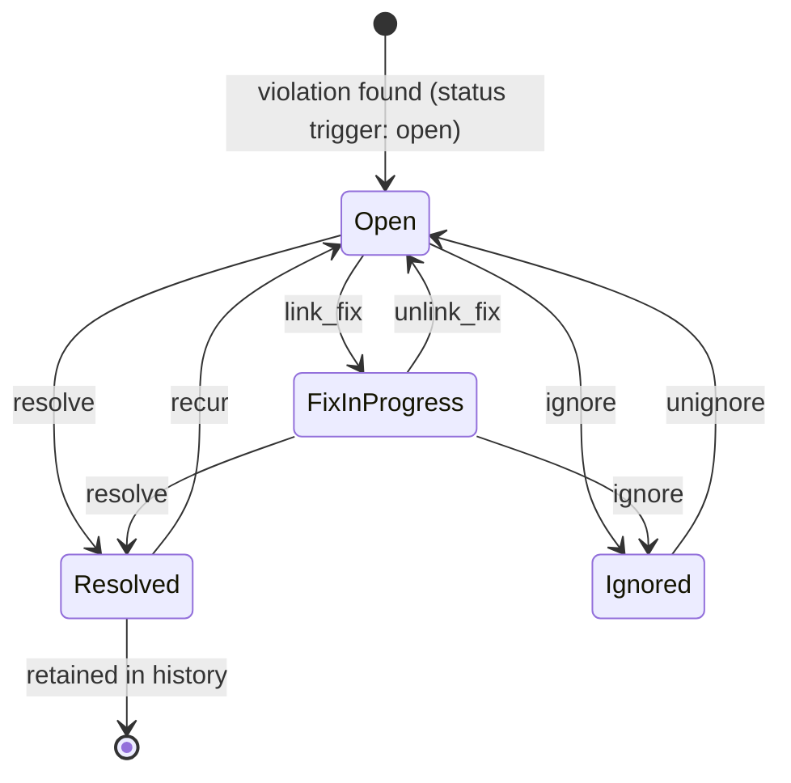

**Closed in this pass:** an `ignored` state implements `/greensecops ignore`
(and a REST `/ignore` endpoint), letting users mute false positives / accepted
risk; the status is a real persisted column with `ignored_at` precedence; a
`resolution_reason` attribute (`no_longer_detected` / `file_removed` /
`merged` / `branch_deleted`) records *why* an issue resolved, set alongside
`resolved_at` and cleared on recur. `branch_deleted` is set by the `delete`
webhook when the branch carrying the issue's workflow file is deleted (see
§8).

**Still open:** `no_longer_detected` conflates a manual fix with a
disabled/removed rule — the two are not distinguishable after re-analysis.

---

## 3. Fix

- **States** — `FixStatus`: `pending`, `generating`, `ready`, `delivering`,
  `delivered`, `failed`, `rejected_by_user`, `superseded_by_closed_pr`,
  `superseded_by_deleted_file`, `landed`
- **Events** — `start_generation`, `generation_succeeded`, `generation_failed`,
  `mark_ready`, `start_delivery`, `precheck_failed`, `delivery_succeeded`,
  `delivery_failed`, `supersede_closed_pr`, `supersede_deleted_file`, `reject`,
  `restore`, `regenerate`, `land`, `swept`
- **Code** — `state_machines/fix.py`; `fix_generation.py`, `fix_delivery.py`,
  `api/routes/fixes.py`, `maintenance.py`, the `pull_request` webhook handler,
  `static_analysis.py` (`_resolve_issues_for_missing_files`)
- **Initial** — `pending`. **Final** — `rejected_by_user`, `landed` (`failed`
  is no longer final — `regenerate` retries it in place).

The two withdrawal-by-the-system states sit alongside the one user rejection
(no longer disambiguated by a `delivered_at IS NULL` convention):

- `rejected_by_user` — a human dismissed the fix; **terminal**. A repeated
  DELETE is made idempotent at the endpoint via `try_advance`, not a self-loop.
- `superseded_by_closed_pr` — the closed-PR delivery guard auto-rejected it;
  `restore` makes it deliverable again when the PR is reopened.
- `superseded_by_deleted_file` — the workflow file this fix targets was
  deleted from the repo (detected during missing-file reconciliation, see
  §8); `restore` makes it deliverable again if a later push re-adds the same
  path.

### Transitions (input → output)

| Event | From → To | Output (SSE) | Guard |
|---|---|---|---|
| `start_generation` | `pending` → `generating` | `fix.generating` | worker picked up |
| `generation_succeeded` | `generating` → `ready` | `fix.ready` | valid workflow YAML |
| `generation_failed` | `generating` → `failed` | `fix.failed` | LLM error / invalid / empty |
| `mark_ready` | `ready`, `delivered` → `ready` | — | unchanged file re-included |
| `start_delivery` | `ready` → `delivering` | `fix.delivering` | (bypassed under `force`) |
| `precheck_failed` | `ready` → `failed` | `fix.failed` | fix has no content |
| `delivery_succeeded` | `delivering` → `delivered` | `fix.delivered` | PR opened / comment posted |
| `delivery_failed` | `delivering` → `failed` | `fix.failed` | push / PR / comment error |
| `supersede_closed_pr` | `ready`, `delivered` → `superseded_by_closed_pr` | `fix.rejected` | target PR branch closed, not forced / a delivered PR closed unmerged |
| `supersede_deleted_file` | `pending`, `generating`, `ready`, `delivering`, `delivered` → `superseded_by_deleted_file` | `fix.rejected` | fix's workflow file missing from the latest push's fetched paths |
| `reject` | any non-terminal → `rejected_by_user` | `fix.rejected` | user DELETE |
| `restore` | `superseded_by_closed_pr`, `superseded_by_deleted_file` → `ready` | — | PR reopened / workflow file path reappears |
| `regenerate` | `failed` → `pending` | `fix.pending` | user retries a failed fix in place |
| `land` | `delivered` → `landed` | `fix.landed` | the fix's PR was merged |
| `swept` | `pending`, `generating`, `delivering` → `failed` | `fix.failed` | stuck > 30 min |

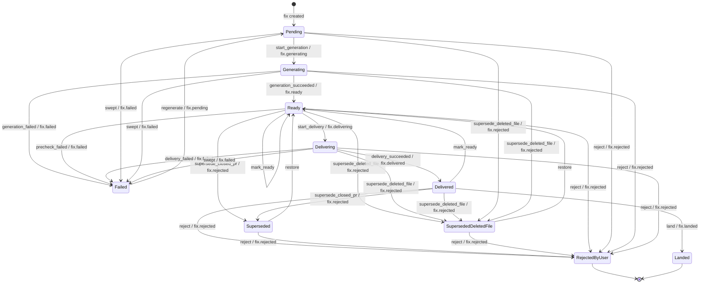

**Closed in this pass:** `supersede_closed_pr` now also fires from `delivered`,
so a delivered PR closed without merging withdraws its fix (restored on reopen)
instead of stranding it; a `regenerate` edge (`failed` → `pending`) retries a
failed fix in place, so `failed` is no longer terminal; a `land` edge
(`delivered` → `landed`) fired from the PR-merge webhook gives a merged fix a
terminal success state and resolves its issues with reason `merged`;
`supersede_deleted_file` (§8) withdraws a fix whose target workflow file was
deleted from the repo, from any non-terminal state, and `restore` brings it
back if the path reappears — closing the fix half of the deleted-workflow-file
gap.

**Still open:** the `fix.skipped` SSE signal has no persisted status (dedup
avoids row bloat — intentional).

---

## 4. Pull Request

- **States** — `PullRequestState`: `open`, `draft`, `merged`, `closed` (column
  is `NOT NULL DEFAULT 'open'` since migration `0027`; legacy `NULL` rows were
  backfilled to `open`)
- **Events** — `redeliver`, `external_update`, `convert_to_draft`,
  `mark_ready_for_review`, `merge`, `close`, `reopen`
- **Attributes** (not states) — `ci_status`, `review_decision`,
  `mergeable_state`, populated by `check_suite` / `pull_request_review` /
  `pull_request` webhooks (migration `0030`); and `externally_modified`
  (migration `0034`), set when a **non-bot** user pushes commits to the
  `greensecops/*` fix branch — it blocks auto-redelivery (the rebase would
  overwrite the user's commits) and is cleared by a successful **forced**
  delivery. `mergeable_state` is additionally refreshed on pushes to the base
  branch (`maintenance.refresh_pr_mergeable_state`, Redis-deduped), since
  GitHub sends no webhook when a base push makes a PR conflicted.
- **Code** — `state_machines/pull_request.py`; `fix_delivery.py`, the
  `pull_request`, `push` and `delete` webhooks,
  `maintenance.sync_open_pr_states`, `fixes.sync_pr_statuses`
- **Initial** — `open`. **Final** — `merged`.

Genuine lifecycle transitions (`merge`, `close`, `reopen`) go through the
machine with `try_advance` at the webhook/reconcile boundaries. PR creation is
initialisation at the delivery boundary; on re-delivery the record advances
through `reopen` (forced redelivery onto a closed PR) or the `redeliver`
self-loop. A `pull_request opened` webhook for a manually opened PR from a
`greensecops/*` branch upserts the record; a `delete` webhook for a
`greensecops/*` branch closes it (and supersedes its fixes) even when GitHub's
own PR-close webhook never arrives.

### Transitions (input → output)

| Event | From → To | Output (SSE) | Source |
|---|---|---|---|
| `redeliver` | `open` → `open` | `pr.updated` | a later delivery updated the branch |
| `external_update` | `open` → `open` | `pr.updated` | webhook `synchronize` / `edited` |
| `convert_to_draft` | `open` → `draft` | `pr.updated` | webhook `converted_to_draft` |
| `mark_ready_for_review` | `draft` → `open` | `pr.updated` | webhook `ready_for_review` |
| `merge` | `open`, `draft` → `merged` | `pr.merged` | webhook `closed`+merged / reconcile |
| `close` | `open`, `draft` → `closed` | `pr.closed` | webhook `closed` (not merged) / webhook `delete` (fix branch) / reconcile |
| `reopen` | `closed` → `open` | `pr.opened` | webhook `reopened` / webhook `opened` (manual PR from fix branch) / forced redelivery |

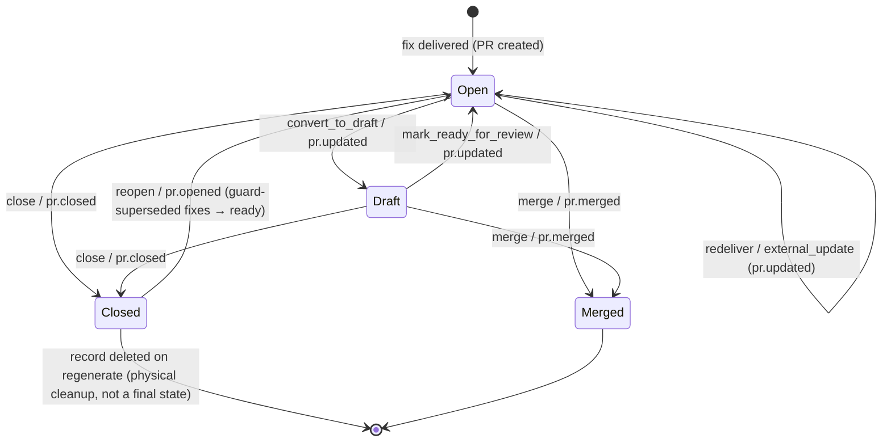

**Closed in this pass:** `synchronize` and `edited` webhook actions are handled
via `external_update`; legacy `NULL` `pr_state` rows were backfilled to `open`
and the column is now `NOT NULL` (migration `0027`); a first-class `draft` state
tracks GitHub's `converted_to_draft` / `ready_for_review`; and CI outcome,
review decision and mergeable-state are captured as **attributes** (via
`check_suite` and `pull_request_review` webhooks) rather than as extra states,
keeping the core graph small.

**Closed in a later pass:** `externally_modified` protects user commits on the
fix branch from being rebased away by auto-redelivery; base-branch pushes
refresh `mergeable_state` on demand; manual PRs from fix branches and manual
fix-branch deletion are reconciled (see above).

**Still open:** CI/review are single-value attributes, not a full check-run
history; no explicit `conflicted` state (surfaced through `mergeable_state`,
and deliberately no auto-rebase on conflict — redelivery force-resets the
branch and would clash with `externally_modified`).

---

## 5. Fix delivery modes

`FixDeliveryMode` selects how a ready fix reaches the repo:

| Mode | Behaviour |
|---|---|
| `pr` (default) | open/update a PR on a `greensecops/…` branch (§4) |
| `comment` | post the suggested changes as a **commit comment** on the base branch HEAD; the comment URL is stored on a per-repo record the fixes link to and surfaced as `FixPublic.comment_url` |
| `disabled` | delivery is skipped |

**Closed in this pass:** `comment` mode is implemented (it previously fell
through to PR delivery).

---

## 6. Dynamic analysis (runtime telemetry) — `TelemetryMachine`

The companion Action posts runtime telemetry to `/telemetry/runs`. `phase`
(`started` / `completed`) is an ingest *category* — the two are separate rows —
so the dynamic-analysis lifecycle is a **separate** `dynamic_status` column
(migration `0032`) driven by `TelemetryMachine`. A `completed`-phase row is
created `queued` at ingest, which enqueues `run_dynamic_analysis`; the worker
evaluates the metrics (e.g. an oversized runner) and **persists** findings to
`dynamic_enrichment` (migration `0025`).

- **States** — `DynamicAnalysisStatus`: `queued`(init), `running`, `enriched`
  (final), `failed`
- **Events** — `started`, `enrich`, `fail`, `retry`, `swept`
- **Code** — `state_machines/telemetry.py`; `api/routes/telemetry.py`,
  `workers/tasks/dynamic_analysis.py`, `maintenance.py`
  (`sweep_stuck_states`)

| Event | From → To | Output (SSE) |
|---|---|---|
| `started` | `queued` → `running` | `dynamic.running` |
| `enrich` | `running` → `enriched` | `dynamic.enriched` |
| `fail` | `running` → `failed` | `dynamic.failed` |
| `retry` | `failed` → `queued` | `dynamic.queued` |
| `swept` | `queued`, `running` → `failed` | `dynamic.failed` |

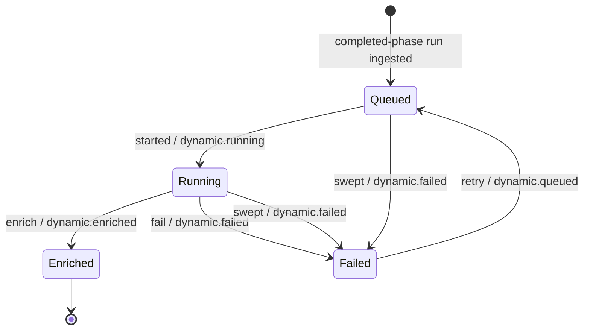

**Closed in this pass:** the dynamic-analysis lifecycle is now a formal machine
with `enriched` / `failed` states (the worker previously wrote no status and let
failures bubble); `started`-phase rows keep `dynamic_status` NULL;
`maintenance.sweep_stuck_states` now also sweeps stuck `queued`/`running` rows
(`collected_at` older than the same 30-minute cutoff used for Analysis/Fix,
since `TelemetryRun` has no `updated_at`) to `failed` via `swept`, so a crashed
`run_dynamic_analysis` worker no longer leaves the row stuck indefinitely.

**Still open:** surfacing the persisted enrichments through the API / UI.

---

## 7. Repository accessibility / lifecycle — `RepositoryMachine`

Repository *accessibility* is now a formal machine over a `status` column
(migration `0031`) rather than an ad-hoc boolean. `is_accessible` is a
machine-synced cache of `status == active`, so the existing write-gates are
unchanged. `enabled` (user opt-in) and `is_external` stay independent flags —
they are a genuinely separate axis (a user can disable an accessible repo).

- **States** — `RepositoryStatus`: `active`(init), `suspended`, `archived`,
  `inaccessible`
- **Events** — `suspend`, `unsuspend`, `archive`, `unarchive`, `lose_access`,
  `regain_access`
- **Code** — `state_machines/repository.py`; the
  `installation`/`installation_repositories`/`repository` webhook handlers and
  `crud.py`

| Event | From → To | Output (SSE) | Cause |
|---|---|---|---|
| `suspend` | `active` → `suspended` | `repository.suspended` | installation suspended |
| `unsuspend` | `suspended` → `active` | `repository.restored` | installation unsuspended |
| `archive` | `active` → `archived` | `repository.archived` | repo archived on GitHub |
| `unarchive` | `archived` → `active` | `repository.restored` | repo unarchived |
| `lose_access` | `active`/`suspended`/`archived` → `inaccessible` | `repository.inaccessible` | installation deleted / repo removed |
| `regain_access` | `inaccessible` → `active` | `repository.restored` | repo re-added |

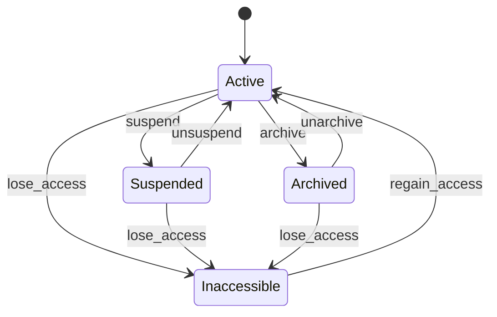

`enabled` gates analysis triggers; `is_accessible` (≡ `status == active`) +
`installation_id` gate fix delivery. `repository` `renamed` / `transferred` /
`edited` webhooks update `full_name` / `default_branch` without a status
change; a default-branch change additionally enqueues an analysis of the new
default branch, since grades, fixes and the default issue listing all key off
it (old-default-branch fixes/PRs retire naturally via the default-branch
gates).

**Closed in this pass:** the accessibility axis is a formal machine with
per-cause SSE signals; the old asymmetry (unsuspend restored `is_accessible` but
not `enabled`) is now explicit — `enabled` is deliberately a separate user-owned
flag, left untouched by accessibility transitions.

**Why `deleted` maps to `inaccessible` rather than a terminal state:** GitHub
soft-deletes repositories (restorable for ~90 days with the *same*
`github_repo_id`), so a restored repo comes back through `regain_access`
exactly like a re-added one. `inaccessible` already blocks analysis and
delivery; a terminal `deleted` state would add a migration and a machine state
for zero extra gating.

---

## 8. Workflow File (existence tracking, not a lifecycle)

`WorkflowFile` rows are not modeled as a state machine — a workflow file
either currently exists at a path on a branch or it doesn't; there is no
persisted `status` column. Rows are keyed **(repo, branch, path)** (unique
constraint since migration `0033`; pre-existing rows were backfilled to the
repo's default branch). Analysis upserts the row for the analysed branch on
every fetch. Three downstream entities point at a `workflow_file_id`:
`Analysis`, `Issue` (via `Analysis`), and `Fix`.

### The branch dimension

Analyses run for pushes on any branch, so without a branch key a
feature-branch run would overwrite the default branch's content and
mis-reconcile its issues. With per-branch rows:

- **Reconciliation is branch-scoped.** `_resolve_stale_issues` is keyed by
  `workflow_file_id` (inherently per-branch); `_resolve_issues_for_missing_files`
  filters rows to the analysed branch. A file absent from a feature branch
  says nothing about `main`.
- **Content dedup is branch-scoped** (`is_duplicate`): identical content on
  two branches is analysed independently, so a merge to `main` re-runs
  reconciliation there instead of being dedup-skipped against the feature
  branch's completed analysis.
- **Fixes and PRs are default-branch-only.** Fix generation (auto and manual),
  auto-delivery and the PR base branch are all gated to
  `repo.default_branch`; feature-branch issues are tracked and displayed
  (issues API `?branch=` filter) but never get Fix rows. Repo grades and the
  default issue/workflow-file listings are likewise scoped to the default
  branch.
- **Branch deletion** (`delete` webhook): a user branch's open issues resolve
  with `resolution_reason=branch_deleted` (rows are kept — see below); a
  `greensecops/*` fix branch closes its PR record and supersedes its fixes.

### What already happens on file deletion

A push webhook that touches `.github/workflows/**` (a `removed` entry counts)
always re-fetches the **full** workflow set, never a single
`workflow_file_id`, so `_resolve_issues_for_missing_files`
(`static_analysis.py`) diffs the fetched paths against the analysed branch's
`WorkflowFile` rows and resolves every open `Issue` on a path
that's gone, with `resolution_reason=file_removed`.

### The gap (closed for Fix; deliberately not for the row itself)

`_auto_queue_fix_generation` (`static_analysis.py`) only reconciles `Fix`
rows for workflow files that have currently **open** issues in the latest
completed analysis. A deleted file has none by the time reconciliation runs
(its issues were just resolved above), so its `workflow_file_id` never used
to appear in that target set — the existing `Fix` row, in *any* state
(`ready`, `delivering`, `delivered`, …), was silently skipped.

`_resolve_issues_for_missing_files` now also withdraws the fix directly: for
every `WorkflowFile` whose path dropped out of `fetched_paths`, if it has a
non-terminal `Fix`, `FixMachine`'s `supersede_deleted_file` event (§3) fires
via `try_advance` — moving it to `superseded_by_deleted_file` regardless of
which non-terminal state it was in. Symmetrically, when an existing
`WorkflowFile` row is matched by path again (the file reappeared), `restore`
fires on its fix if superseded. This closes:

- **Not transitioned** — now has a dedicated event instead of silently
  skipping.
- **Not cleaned up** — a superseded fix is excluded from the "active fix"
  filter (`REJECTED_STATUSES`, `fix.py:29`) the same way a user-rejected one
  is, so it can't be manually delivered or ride along in a batch.
- **PR left stale** — a `delivered` fix withdrawn this way stops being
  re-included by the batch reset-and-reapply flow (§3), so its next
  redelivery correctly drops the file.

**Row never dies** is left open on purpose: `Issue.workflow_file_id` and
`Fix.workflow_file_id` are both `ondelete="CASCADE"` on `WorkflowFile`.
Physically deleting a `WorkflowFile` row to reclaim space would cascade-delete
every `Issue` ever raised against it — including ones resolved with
`resolution_reason=file_removed` — destroying audit history for a cosmetic
row-count cleanup. Orphaned `WorkflowFile` rows are inert text blobs, not a
correctness problem, so they're left in place; only a full `Repository`
delete cascades them away.

---

## 9. IaC / cloud posture — `ScanMachine`, `FindingMachine`, `CloudAccountMachine`

The Terraform and AWS cloud-posture engines (`TerraformRoot`/`TerraformScan`/
`TerraformFinding` and `CloudAccount`/`CloudScan`/`CloudFinding`) share their
lifecycle machines across both domains rather than each domain declaring its
own — the two engines' scan/finding lifecycles are identical, only the source
of the input differs (fetched `.tf` files vs. a live AWS API sweep).

### `ScanMachine` — mirrors `AnalysisMachine`

- **States** — `ScanStatus`: `queued`(init), `running`, `completed`(final),
  `failed`, `no_targets`(final)
- **Events** — `started`, `succeeded`, `scan_failed`, `no_targets_found`,
  `swept`, `retry`
- **Code** — `state_machines/scan.py`; `workers/tasks/terraform_analysis.py`,
  `workers/tasks/cloud_scan.py`

| Event | From → To |
|---|---|
| `started` | `queued` → `running` |
| `succeeded` | `running` → `completed` |
| `scan_failed` | `running` → `failed` |
| `no_targets_found` | `running` → `no_targets` |
| `swept` | `queued`, `running` → `failed` |
| `retry` | `failed` → `queued` |

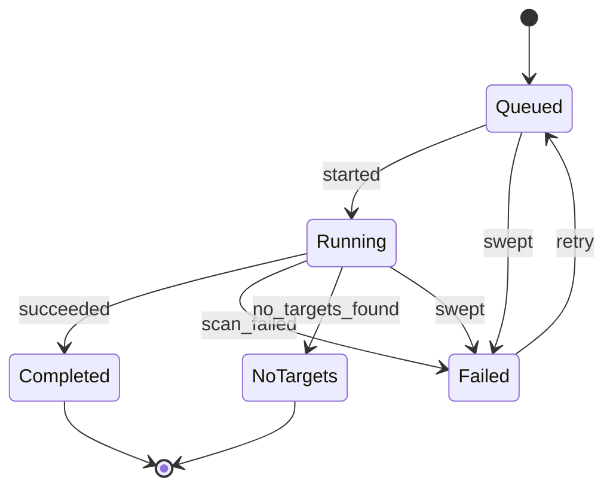

**Asymmetry between the two domains:** `no_targets_found` only ever fires for
`TerraformScan` (a root with no `.tf` files fetched). `CloudScan` never fires
it — an AWS account with zero resources of the curated types is still a valid
(clean) scan, not a "nothing to scan" state, so `cloud_scan.py` always
proceeds through to `succeeded`.

No SSE wiring yet — same as `AnalysisMachine` before the frontend consumed
its signals; lands with whichever phase adds live scan-status updates to the
Infrastructure/Cloud pages.

### `FindingMachine`

Unlike `Issue.status` (a DB-trigger-derived column reacting to
`fix_id`/`resolved_at`/`ignored_at`, with `IssueMachine` only documenting the
graph), `TerraformFinding`/`CloudFinding` have no fix/PR concept yet, so this
machine directly drives writes via `sm.advance`/`sm.try_advance` the way
`AnalysisMachine` does — there is no trigger to keep in sync.

- **States** — `FindingStatus`: `open`(init), `resolved`, `ignored`
- **Events** — `resolve`, `recur`, `ignore`, `unignore`
- **Code** — `state_machines/finding.py`; the rescan `resolve` path is wired
  in both worker tasks (`_resolve_stale_findings`)

| Event | From → To | Meaning |
|---|---|---|
| `resolve` | `open` → `resolved` | not seen in the latest scan (fixed or target removed) |
| `recur` | `resolved` → `open` | the violation reappeared on a later scan |
| `ignore` | `open` → `ignored` | user dismissed it |
| `unignore` | `ignored` → `open` | user un-dismissed it |

**Still open:** only `resolve` is wired (rescan finding-becomes-stale
detection). `recur`, `ignore`, and `unignore` are declared but have no API
route or worker call site yet — no ignore/unignore endpoint exists for
Terraform or Cloud findings, and a resolved finding that recurs on a rescan
is currently re-inserted as a fresh row via the fingerprint upsert
(`ON CONFLICT ... resolved_at = NULL`) rather than going through `recur`
explicitly. Tightening that to fire the event is future cleanup, not a
correctness gap — the persisted end state is the same either way.

### `CloudAccountMachine`

Tracks the AssumeRole+ExternalId connection wizard: a newly created
`CloudAccount` starts unverified, the first (or any subsequent) scan verifies
or fails it, and an admin can disable/re-enable it.

- **States** — `CloudAccountStatus`: `pending_verification`(init),
  `connected`, `error`, `disabled`
- **Events** — `verify`, `verification_failed`, `disable`, `enable`
- **Code** — `state_machines/cloud_account.py`; `workers/tasks/cloud_scan.py`,
  `api/routes/cloud.py`

| Event | From → To |
|---|---|
| `verify` | `pending_verification`, `error` → `connected` |
| `verification_failed` | `pending_verification`, `connected` → `error` |
| `disable` | `pending_verification`, `connected`, `error` → `disabled` |
| `enable` | `disabled` → `pending_verification` |

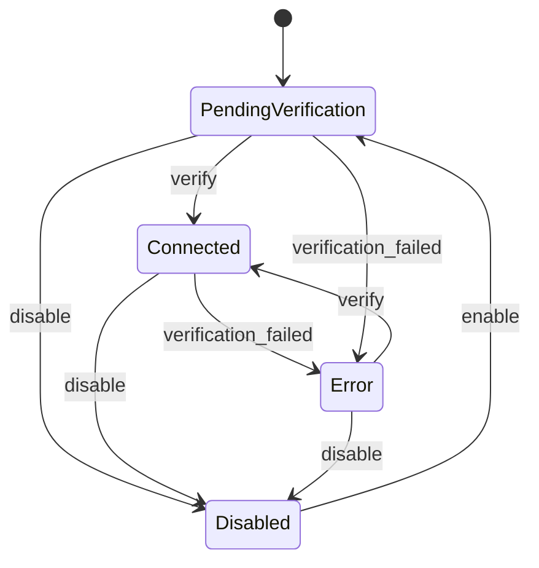

**Why `enable` lands on `pending_verification`, not `connected`:** the role's
trust policy or permissions may have changed while the account sat disabled,
so re-enabling forces a re-verify (the next scan) before it's trusted as
`connected` again, rather than resuming on stale trust.

---

## 10. Billing subscription — `BillingSubscriptionMachine`

The *payment* lifecycle, which is orthogonal to the plan. `UserTier` says what
was bought and never changes on its own; these states say whether it is
currently being paid for. Only
`services/billing/lifecycle.effective_tier` combines the two, and it is the
single thing quota enforcement reads.

- **States** — `SubscriptionStatus`: `incomplete`(init), `trialing`, `active`,
  `past_due`, `unpaid`, `pending_cancellation`, `canceled`(final)
- **Events** — `checkout_completed`, `trial_started`, `trial_converted`,
  `trial_ended`, `payment_failed`, `payment_succeeded`, `grace_expired`,
  `cancel_requested`, `resumed`, `period_ended`, `subscription_deleted`,
  `plan_changed`
- **Code** — `state_machines/billing.py`; `services/billing/lifecycle.py`
  (transitions), `api/routes/billing.py` (the Stripe webhook),
  `workers/tasks/billing.py` (dunning and grace expiry)

| Event | From → To |
|---|---|
| `checkout_completed` | `incomplete` → `active` |
| `trial_started` | `incomplete` → `trialing` |
| `trial_converted` | `trialing` → `active` |
| `trial_ended` | `trialing` → `past_due` |
| `payment_failed` | `active`, `trialing` → `past_due` |
| `payment_succeeded` | `past_due`, `unpaid` → `active` |
| `grace_expired` | `past_due` → `unpaid` |
| `cancel_requested` | `active`, `trialing`, `past_due` → `pending_cancellation` |
| `resumed` | `pending_cancellation` → `active` |
| `period_ended` | `pending_cancellation` → `canceled` |
| `subscription_deleted` | any non-final → `canceled` |
| `plan_changed` | `active` → `active`, `trialing` → `trialing` (self) |

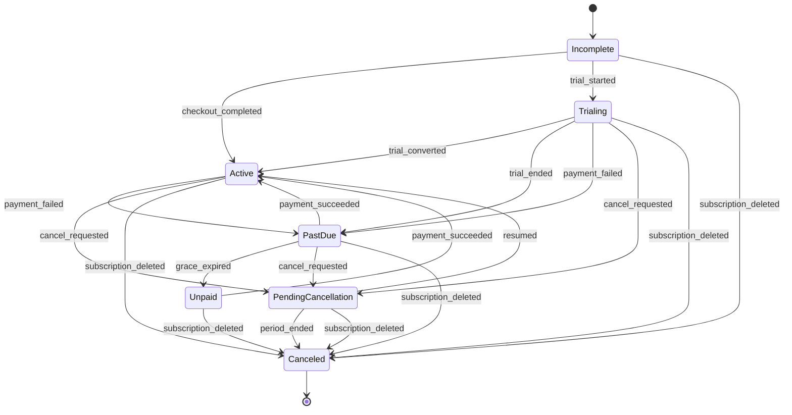

**The grace window is the shape worth understanding.** A failed payment moves
`active → past_due` and *nothing else happens*: the account keeps its full paid
limits while `workers/tasks/billing.py` emails reminders on days 0, 3, 7 and 13
(`BILLING_DUNNING_DAYS`). Only when the window closes does `grace_expired` move
it to `unpaid`, which is the first state that costs the user anything — and
even then it is a limit change, not a deletion. `ENTITLED_STATUSES` in
`state_machines/billing.py` is that policy written once:

| Status | Limits applied | Why |
|---|---|---|
| `trialing`, `active` | the purchased plan | paid, or promised |
| `past_due` | the purchased plan | inside the grace window |
| `pending_cancellation` | the purchased plan | paid through period end |
| `unpaid`, `canceled`, `incomplete` | Free | nothing has been collected |

**Why `incomplete` is the initial state:** it is the genuine "nothing has been
paid yet" state a Checkout-created subscription starts in. Accounts that never
bought anything are created directly as `active` on the free tier via the
column default — there is nothing to collect from them, so there is nothing to
be incomplete about.

**Why transitions go through `try_advance`, not `advance`:** almost every
caller is a Stripe webhook, and Stripe redelivers and reorders exactly like
GitHub does. A `payment_failed` arriving twice must be a no-op rather than a
crash — and, critically, must not restart the grace window, which is why
`lifecycle.transition` only stamps `grace_expires_at` on a transition that
actually fired. Redelivery is also caught earlier, by the `stripe_event_id`
recorded in `billing_webhook_event`.

---

## 11. Target activity — what a target is busy with

Every lifecycle above drives a **persisted** column. This one does not: it is
derived, and it is the machine the engine pages' buttons actually obey.

A scan target — a Terraform root, a Docker target, an Ansible project, a cloud
account, a workflow file, or a whole repository on the CI engine — has no
status column of its own. What it is *doing* is the union of its latest scan's
status and its fixes' statuses, and that union decides which of the three
actions every engine offers (`POST .../scans`, `POST .../fixes`,
`POST .../deliveries`) may run.

Code: [`services/state_machines/engine_target.py`](../backend/app/services/state_machines/engine_target.py)
(the pure rule), `api/engine_routes.py` (`require_idle` / `require_target_idle`,
the HTTP half), and `frontend/src/lib/engine-actions.ts` (the same rule, so the
buttons say in advance what the API would refuse). The reason strings are kept
identical across all three.

### States

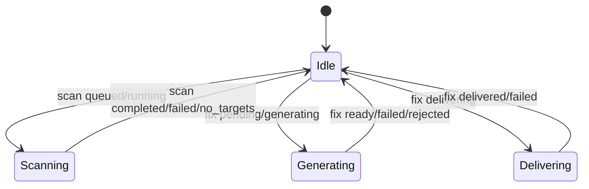

Several can hold at once, so one is reported, by precedence:
**`scanning` > `delivering` > `generating` > `idle`**. A scan outranks fix work
because it rewrites what the fixes are about; a delivery outranks generation
because it names the shorter, more specific wait.

### Which activity blocks which action

| | `scan` | `generate` | `deliver` |
|---|---|---|---|
| `idle` | ✅ | ✅ | ✅ |
| `scanning` | ❌ | ❌ | ❌ |
| `generating` | ❌ | ✅ | ❌ |
| `delivering` | ❌ | ❌ | ❌ |

`generate` is the one action a `generating` target still allows: writing a fix
for file B while file A's is in flight is ordinary work, and
`prepare_pending_fix` already declines to reset a file whose own fix a worker
holds.

A refusal is a **409** reading
`Cannot <action> while <reason> for this <target>`, e.g.
`Cannot open a pull request while a scan is already running for this Terraform root`.

### Scope

Activity is only ever read within the unit the action addresses:

| Scope | Used by | Scans counted | Fixes counted |
|---|---|---|---|
| repository | the CI engine's repo-wide routes | **any** unfinished scan for the repo | every fix, joined through `WorkflowFile` |
| target | a registered root / target / project / account | the **most recent** scan, whatever its outcome | that target's fixes |
| file | per-file generate and per-fix delivery | the owning repo's or target's | that file's own fix |

The two scan rules differ on purpose. A registered target follows "the most
recent scan", which is exactly what `mappers.base.latest_scan_status` puts on
its card, so the tooltip and the badge on screen can never disagree. The CI
engine follows "any unfinished scan", because `static_analysis` takes one
`scan_lock("static_analysis:<repo>")` for the whole repository and writes one
scan row per workflow file — "the latest row" is regularly a finished sibling
of one still running.

### What is deliberately *not* guarded

- **Service/OIDC fan-out routes** (`POST /{engine}/scans`, `POST /workflow/scans`)
  — CI ingestion has to stay idempotent, and a GitHub Action retrying is not a
  user double-clicking.
- **`force`** overrides a fix's own status ("deliver this even though it isn't
  `ready`"); it does not override a collision with work a worker is doing right
  now.
- **Failed scans.** `failed` and `no_targets` are finished outcomes. Counting
  them as activity would leave a target permanently unscannable after one bad
  run.

**Why 409 rather than the old 202:** the duplicate was already being discarded
— by the Redis lock in the worker, or by `prepare_pending_fix` — but nothing
said so, and the UI had no way to know. Same reasoning as the 402
`enforce_quota` raises: fail where the user can see it, rather than letting
them watch a job disappear.
