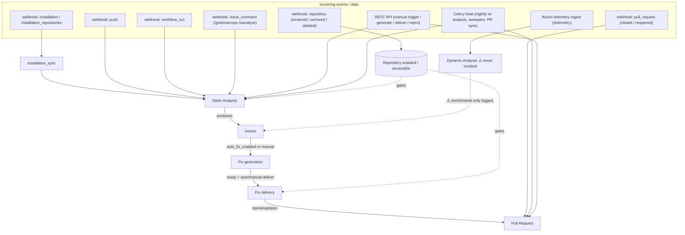
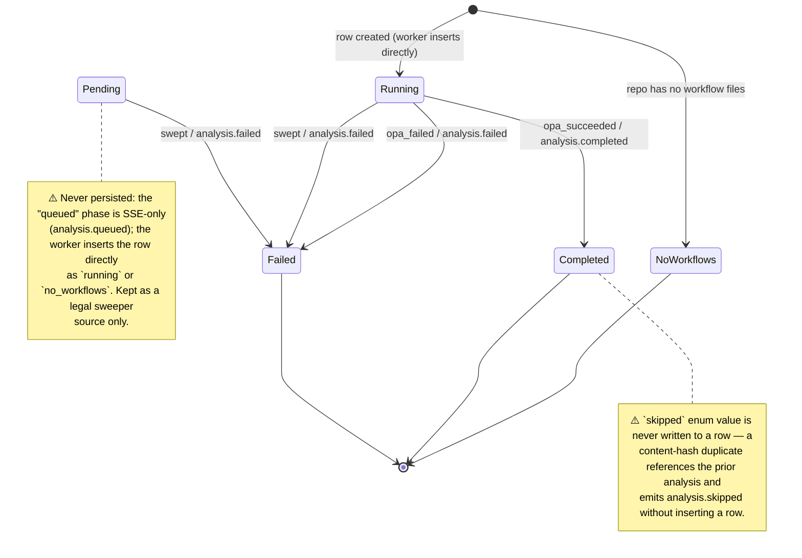
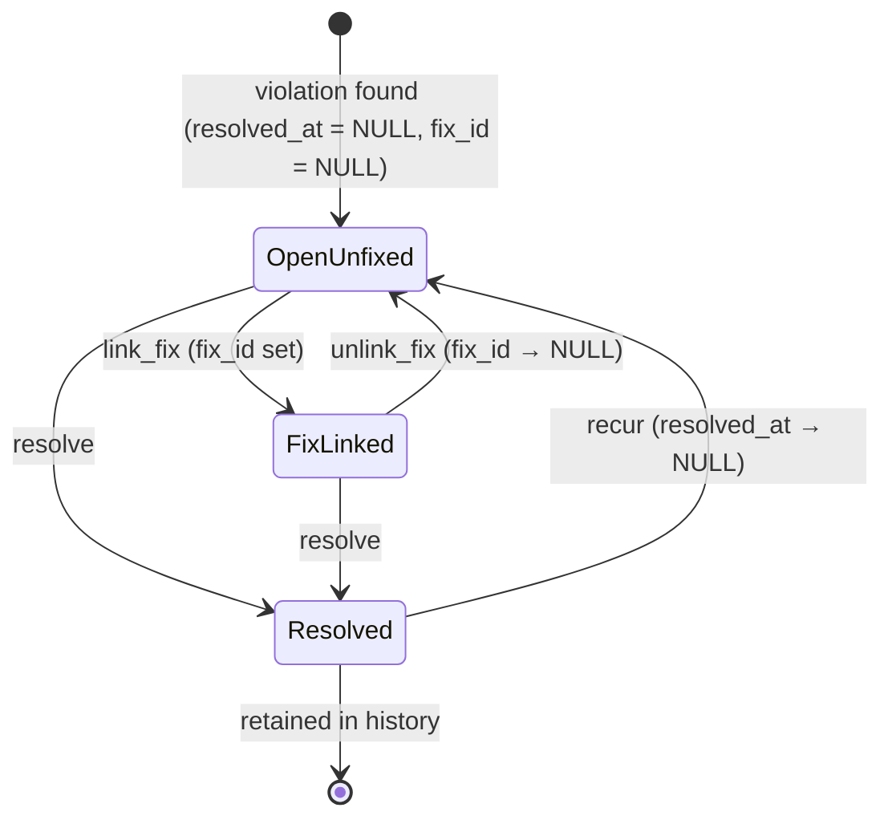
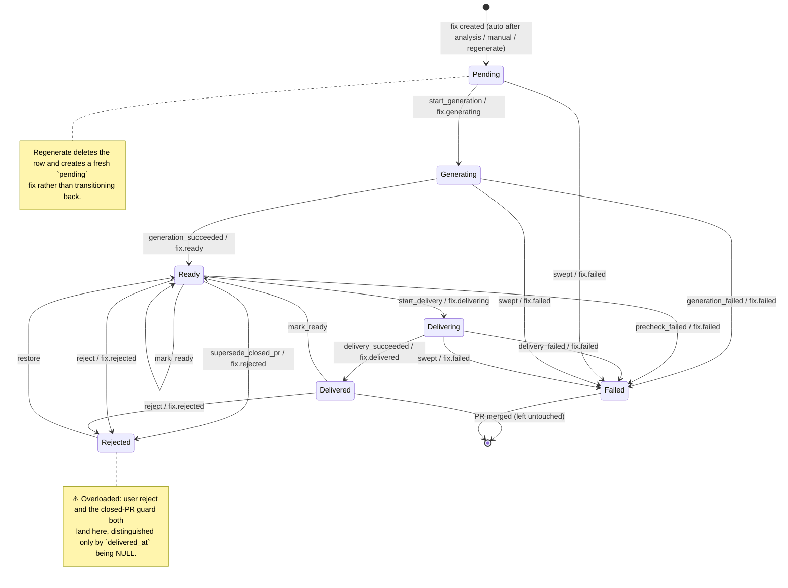
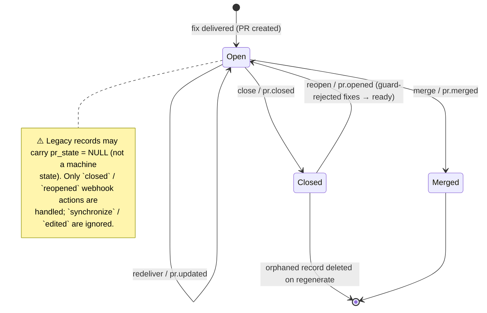

# GreenSecOps — Workflow State Machines

This document formalizes the four core lifecycles — **Analysis**, **Issue**,
**Fix**, and **Pull Request** — as state machines: their **states**, the
**input events** that drive transitions, and the **outputs** (SSE signals) each
transition emits. It is kept in sync with the code in
[`backend/app/services/state_machines/`](../backend/app/services/state_machines),
which is the single source of truth.

## Formalization in code

Each lifecycle is declared as a `StateMachine` of `Transition` records
(`app/services/state_machines/base.py`):

| Concept | In code |
|---|---|
| **State** | the existing status enum (`AnalysisStatus`, `FixStatus`, `PullRequestState`) or the derived `IssueStatus` |
| **Input event** | a per-machine `*Event` enum (`AnalysisEvent`, `FixEvent`, `PullRequestEvent`, `IssueEvent`) |
| **Transition** | `Transition(event, sources, dest, output, guard, description)` |
| **Output** | the `SSESignal` the application emits when the transition fires |

Call sites no longer assign status directly; they ask the machine to advance it,
so an illegal transition raises instead of silently corrupting state:

```python
from app.services.state_machines import fix_machine, FixEvent

fix_machine.trigger(fix, FixEvent.start_generation)   # pending → generating; raises if illegal
fix_machine.try_trigger(pr, PullRequestEvent.reopen)  # idempotent no-op at webhook boundaries
fix_machine.apply(fix, FixEvent.start_delivery, force=force)  # admin override bypasses source guard
```

- **`trigger`** — validates the source state and advances, else raises
  `IllegalTransition`. Used on the normal worker/API paths.
- **`try_trigger`** — advances only if legal, else returns `False` without
  raising. Used at boundaries where GitHub may **redeliver or reorder** events
  (the `pull_request` webhook, missed-webhook reconciliation).
- **`force` / `apply(..., force=True)`** — sets the destination while bypassing
  the source check, for explicit administrator overrides (forced fix delivery).

> Legend: solid transitions exist in code today. States/transitions annotated
> with **⚠️** are gaps — an enum value that is never persisted, or a real-world
> transition the system does not yet handle. Per the plan, this pass formalizes
> **current behavior**; the ⚠️ items are left for a follow-up.

---

## 0. Pipeline Overview

How the entities chain together, and where external events enter.



---

## 1. Analysis

- **States** — `AnalysisStatus`: `pending`, `running`, `completed`, `failed`,
  `skipped`, `no_workflows`
- **Events** — `AnalysisEvent`: `opa_succeeded`, `opa_failed`, `swept`
- **Code** — `state_machines/analysis.py`; behavior in
  `workers/tasks/static_analysis.py`, `maintenance.py`
- **Initial** — `running`, `no_workflows` (`pending` declared but never
  persisted). **Terminal** — `completed`, `failed`, `no_workflows`.

### Transitions (input → output)

| Event (input) | From → To | Output (SSE) | Guard |
|---|---|---|---|
| `opa_succeeded` | `running` → `completed` | `analysis.completed` | OPA eval produced a score |
| `opa_failed` | `running` → `failed` | `analysis.failed` | OPA eval raised |
| `swept` | `pending`, `running` → `failed` | `analysis.failed` | `created_at` older than 30 min |

### External triggers (what enqueues an analysis)

| Source | Trigger | `AnalysisTrigger` |
|---|---|---|
| webhook `push` (touches `.github/workflows/**` or new branch) | enqueue | `webhook_push` |
| webhook `workflow_run` (`completed`) | enqueue | `webhook_workflow_run` |
| webhook `issue_comment` (`/greensecops reanalyze`) | enqueue (`force`) | `manual` |
| REST `POST /analyses/trigger/{repo}` | enqueue (`force`) | `manual` |
| REST `POST /analyses/reanalyze-all`, version ship | fan-out | `release` |
| `installation_sync` (first sync of a repo) | enqueue | `manual` |
| Celery beat `nightly-reanalysis` | fan-out (`force=False`) | `scheduled` |
| `fix_delivery` stale-content error | enqueue (`force`) | `manual` |

### State machine



### ⚠️ Missing states / transitions

1. **`pending` never persisted** — the queued phase is SSE-only; the sweeper
   still lists `pending` as a source that can never occur.
2. **`skipped` never persisted** — duplicate detection references the prior
   analysis, so the enum value is dead (absent from the machine graph).
3. **No "retries exhausted" state** distinct from `failed`.
4. **Dynamic analysis is disconnected** — `run_dynamic_analysis` is never
   called, and its enrichments are only logged, never attached to an analysis.

---

## 2. Issue

Issues carry **no status column**; the state is **derived** from `resolved_at`
and `fix_id` via `Issue.status` → `IssueStatus`. The machine is therefore the
canonical, testable declaration of the field-level transitions the code
performs; the derived property guarantees only valid states are ever observed.

- **States** — `IssueStatus`: `open`, `fix_in_progress`, `resolved`
- **Events** — `IssueEvent`: `link_fix`, `unlink_fix`, `resolve`, `recur`
- **Code** — `state_machines/issue.py`; behavior in `static_analysis.py`
  (`_resolve_stale_issues`, `_resolve_issues_for_missing_files`, the upsert) and
  the fix routes.
- **Derivation** — `resolved_at` set ⇒ `resolved`; else `fix_id` set ⇒
  `fix_in_progress`; else `open`.

### Transitions (input → derived state)

| Event (input) | From → To | Underlying field change |
|---|---|---|
| `link_fix` | `open` → `fix_in_progress` | `fix_id` set (fix queued) |
| `unlink_fix` | `fix_in_progress` → `open` | `fix_id` → `NULL` (fix deleted/regenerated) |
| `resolve` | `open`, `fix_in_progress` → `resolved` | `resolved_at` set (not in latest run / file deleted / user fix) |
| `recur` | `resolved` → `open` | `resolved_at` → `NULL` (violation reappears) |

### State machine



### ⚠️ Missing states / transitions

1. **No "ignored / muted" state** — `/greensecops ignore` is parsed but
   unimplemented; a user cannot dismiss a false positive.
2. **`resolved` records no reason** (user fix vs. rule disabled vs. merged).
3. **No immediate "fixed & merged"** — a merged fix resolves its issues only on
   the *next* analysis of the default branch.

---

## 3. Fix

- **States** — `FixStatus`: `pending`, `generating`, `ready`, `delivering`,
  `delivered`, `failed`, `rejected`
- **Events** — `FixEvent`: `start_generation`, `generation_succeeded`,
  `generation_failed`, `mark_ready`, `start_delivery`, `precheck_failed`,
  `delivery_succeeded`, `delivery_failed`, `supersede_closed_pr`, `reject`,
  `restore`, `swept`
- **Code** — `state_machines/fix.py`; behavior in `fix_generation.py`,
  `fix_delivery.py`, `api/routes/fixes.py`, `maintenance.py`
- **Initial** — `pending`. **Terminal (resting)** — `delivered`, `failed`,
  `rejected` (re-entrant: `delivered`/`rejected` have outgoing edges).

### Transitions (input → output)

| Event (input) | From → To | Output (SSE) | Guard |
|---|---|---|---|
| `start_generation` | `pending` → `generating` | `fix.generating` | worker picked up |
| `generation_succeeded` | `generating` → `ready` | `fix.ready` | valid workflow YAML |
| `generation_failed` | `generating` → `failed` | `fix.failed` | LLM error / invalid / empty |
| `mark_ready` | `ready`, `delivered` → `ready` | — | unchanged file re-included in delivery |
| `start_delivery` | `ready` → `delivering` | `fix.delivering` | (bypassed under `force`) |
| `precheck_failed` | `ready` → `failed` | `fix.failed` | fix has no generated content |
| `delivery_succeeded` | `delivering` → `delivered` | `fix.delivered` | PR opened/updated |
| `delivery_failed` | `delivering` → `failed` | `fix.failed` | push / PR error |
| `supersede_closed_pr` | `ready` → `rejected` | `fix.rejected` | target PR branch closed, not forced |
| `reject` | any non-in-flight (+ `rejected`) → `rejected` | `fix.rejected` | user DELETE (idempotent) |
| `restore` | `rejected` → `ready` | — | PR reopened; guard-rejected only (`delivered_at` NULL) |
| `swept` | `pending`, `generating`, `delivering` → `failed` | `fix.failed` | `created_at` older than 30 min |

### State machine



### ⚠️ Missing states / transitions

1. **`rejected` is two states** (user reject vs. closed-PR guard),
   disambiguated only by `delivered_at IS NULL`.
2. **`failed` has no auto-recovery** — a transient failure needs a manual
   regenerate; there is no automatic edge back to `pending`.
3. **`fix.skipped` is SSE-only**, never a persisted status.
4. **Delivered-then-closed** (not merged) leaves the fix `delivered` though its
   code never landed.
5. **Comment delivery mode unimplemented** — `FixDeliveryMode.comment` /
   `PullRequest.comment_url` exist but delivery only ever opens a PR.

---

## 4. Pull Request

- **States** — `PullRequestState`: `open`, `merged`, `closed` (column nullable —
  legacy `NULL` records exist)
- **Events** — `PullRequestEvent`: `redeliver`, `merge`, `close`, `reopen`
- **Code** — `state_machines/pull_request.py`; behavior in `fix_delivery.py`,
  the `pull_request` webhook, `maintenance.sync_open_pr_states`,
  `fixes.sync_pr_statuses`
- **Initial** — `open`. **Terminal** — `merged`.

PR **creation** and the "ensure open on re-delivery" reconciliation happen at
the delivery boundary as initialization, not guarded transitions; `redeliver`
is declared to document that self-loop. The genuine lifecycle transitions —
`merge`, `close`, `reopen` — are routed through the machine (with `try_trigger`
at the webhook/reconcile boundaries so redelivered/reordered events no-op).

### Transitions (input → output)

| Event (input) | From → To | Output (SSE) | Source |
|---|---|---|---|
| `redeliver` | `open` → `open` | `pr.updated` | a later delivery updated the branch |
| `merge` | `open` → `merged` | `pr.merged` | webhook `closed`+merged / reconcile |
| `close` | `open` → `closed` | `pr.closed` | webhook `closed` (not merged) / reconcile |
| `reopen` | `closed` → `open` | `pr.opened` | webhook `reopened` |

### State machine



### ⚠️ Missing states / transitions

1. **Only `closed` / `reopened` webhook actions handled** — `synchronize` /
   `edited` are not tracked.
2. **`NULL` (stateless) records** exist alongside the three real states.
3. **No CI / review / merge-conflict states** — delivery can't react to a red or
   conflicting PR.
4. **No draft state** and no representation of the (unimplemented) inline
   `comment` delivery channel.

---

## Cross-cutting: Repository / Installation gating

Every machine above is gated by repository flags that are themselves driven by
webhooks (not a persisted state machine, but the inputs matter):

| Event | Effect on `Repository` |
|---|---|
| webhook `installation` `created` / `unsuspend` | sync repos, mark accessible |
| webhook `installation` `deleted` / `suspend` | mark all repos `is_accessible = False` |
| webhook `installation_repositories` `added` / `removed` | toggle accessibility / disable |
| webhook `repository` `archived` / `deleted` | `enabled = False`, `is_accessible = False` |
| webhook `repository` `unarchived` | re-enable |
| webhook `repository` `renamed` / `transferred` | update `full_name` / `default_branch` |

`enabled` gates analysis triggers; `is_accessible` + `installation_id` gate fix
delivery.
