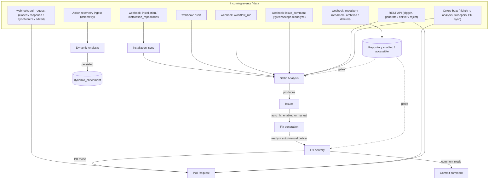
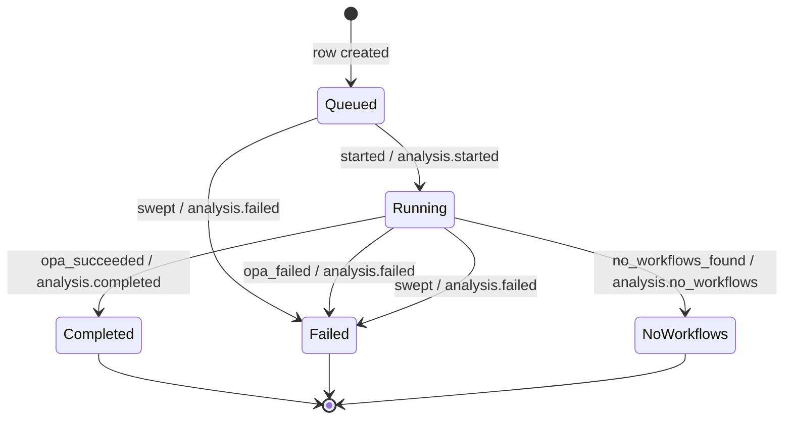
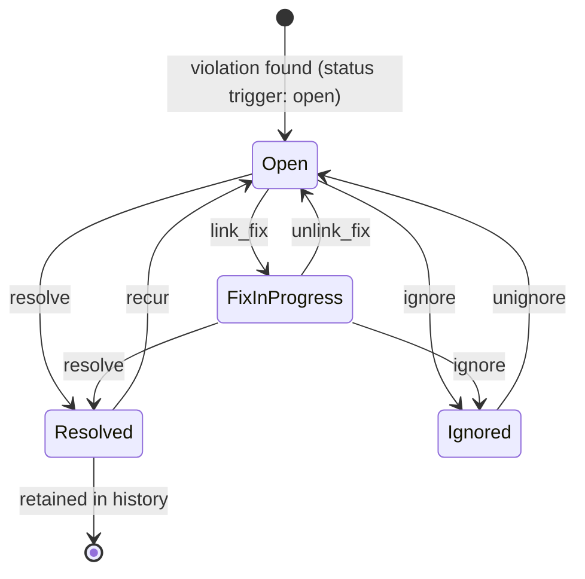
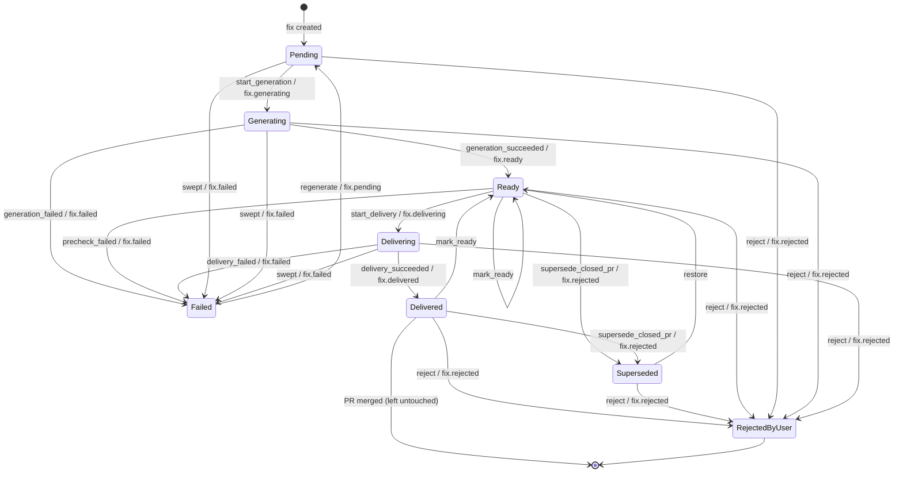
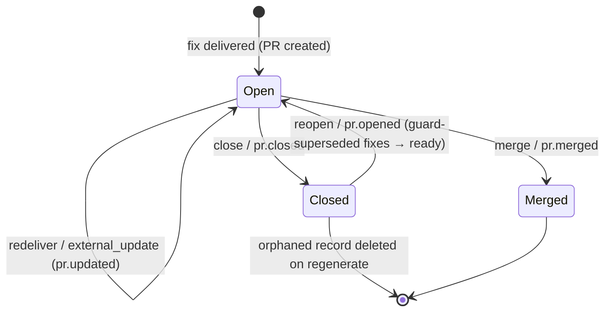

# GreenSecOps — Workflow State Machines

This document formalizes the four core lifecycles — **Analysis**, **Issue**,
**Fix**, and **Pull Request** — as state machines: their **states**, the
**input events** that drive transitions, and the **outputs** (SSE signals) each
transition emits. It is kept in sync with the code in
[`backend/app/services/state_machines/`](../backend/app/services/state_machines),
which is the single source of truth.

## Formalization in code

Each lifecycle is a [`python-statemachine`](https://pypi.org/project/python-statemachine/)
`StateMachine` subclass (`analysis.py`, `fix.py`, `pull_request.py`,
`issue.py`). States carry the persisted status-enum value they map to; events
declare the transitions; a per-machine `outputs` map records the `SSESignal`
each event emits.

| Concept | In code |
|---|---|
| **State** | `State(value=<StatusEnum>.x, final=…)` — the persisted column value |
| **Input event** | a `<source>.to(<dest>)` transition method on the machine |
| **Output** | `Machine.outputs[event]` → the `SSESignal` emitted when it fires |

The library enforces a **single connected graph** with **one initial state**;
states with no outgoing edge must be `final`. Call sites never assign status
directly — they go through thin helpers in `base.py` so an illegal transition
raises instead of corrupting state:

```python
from app.services import state_machines as sm

sm.advance(fix, sm.FixMachine, "start_generation")      # raises on illegal transition
sm.try_advance(pr, sm.PullRequestMachine, "reopen")     # idempotent no-op at webhook boundaries
sm.force_to(fix, sm.FixMachine, FixStatus.delivering)   # admin override (forced delivery)
```

- **`advance`** — validates the source state and fires, else raises
  `IllegalTransition`. Normal worker/API paths.
- **`try_advance`** — fires only if legal, else returns `False`. Boundaries
  where GitHub may **redeliver or reorder** events, and it leaves a `NULL`
  legacy state column untouched (no auto-initialisation).
- **`force_to`** — sets the destination directly, bypassing the source guard,
  for explicit administrator overrides (forced fix delivery).

> This document reflects the **closed-gap** behaviour. Each machine ends with
> what was **closed** in the formalization pass and what remains **open**.

---

## 0. Pipeline Overview



---

## 1. Analysis

- **States** — `AnalysisStatus`: `queued`, `running`, `completed`, `failed`,
  `no_workflows`
- **Events** — `started`, `opa_succeeded`, `opa_failed`, `no_workflows_found`,
  `swept`
- **Code** — `state_machines/analysis.py`; `workers/tasks/static_analysis.py`,
  `maintenance.py`
- **Initial** — `queued`. **Final** — `completed`, `failed`, `no_workflows`.

Rows are inserted as `queued` and advance to `running` (`started`) when the
worker begins OPA evaluation, so a row that dies before the worker starts is
distinguishable (still `queued`) from one that hangs mid-eval (`running`) — the
sweeper covers both.

### Transitions (input → output)

| Event | From → To | Output (SSE) | Guard |
|---|---|---|---|
| `started` | `queued` → `running` | `analysis.started` | worker begins OPA eval |
| `opa_succeeded` | `running` → `completed` | `analysis.completed` | OPA eval produced a score |
| `opa_failed` | `running` → `failed` | `analysis.failed` | OPA eval raised |
| `no_workflows_found` | `running` → `no_workflows` | `analysis.no_workflows` | repo has no workflow files |
| `swept` | `queued`, `running` → `failed` | `analysis.failed` | `created_at` older than 30 min |

### External triggers

| Source | `AnalysisTrigger` |
|---|---|
| webhook `push` (touches `.github/workflows/**` or new branch) | `webhook_push` |
| webhook `workflow_run` (`completed`) | `webhook_workflow_run` |
| webhook `issue_comment` (`/greensecops reanalyze`) / REST trigger | `manual` |
| `reanalyze-all`, version ship | `release` |
| `installation_sync` (first sync) | `manual` |
| Celery beat `nightly-reanalysis` | `scheduled` |
| `fix_delivery` stale-content error | `manual` |

### State machine



**Closed in this pass:** a `queued` initial state models the worker-pickup phase
so `analysis.started` maps to a real transition and the sweeper distinguishes
never-started from hung rows; the never-persisted `pending`/`skipped` values are
gone; dynamic analysis is wired in (§6).

**Still open:** no dedicated "retries exhausted" state distinct from `failed`;
the broker-queue window *before* the worker picks the task up is still SSE-only
(a per-row `queued` would need a parent "analysis run" entity).

---

## 2. Issue

`Issue.status` is a **persisted, indexed column** (`IssueStatus`) maintained by
a database trigger that computes it from `ignored_at` + `resolved_at` + `fix_id`
(migrations `0022`/`0026`). The trigger keeps it authoritative even when `fix_id`
is cleared by the `ON DELETE SET NULL` cascade on fix deletion — which bypasses
application code — so the column can never disagree with the underlying fields.
The machine therefore documents and validates the legal field-level
transitions; the trigger owns writes.

- **States** — `IssueStatus`: `open`, `fix_in_progress`, `resolved`, `ignored`
- **Events** — `link_fix`, `unlink_fix`, `resolve`, `recur`, `ignore`,
  `unignore`
- **Code** — `state_machines/issue.py`; trigger in migrations `0022`/`0026`;
  `api/routes/issues.py` (`/ignore`, `/unignore`), `/greensecops ignore
  <fingerprint>` comment command in the webhook handler

`ignored` takes precedence in the trigger: a muted violation reads `ignored`
regardless of fix/resolve activity, and drops out of the default (active) issue
and fix-generation queries.

### Transitions

| Event | From → To | Underlying field change |
|---|---|---|
| `link_fix` | `open` → `fix_in_progress` | `fix_id` set |
| `unlink_fix` | `fix_in_progress` → `open` | `fix_id` → `NULL` (fix deleted) |
| `resolve` | `open`, `fix_in_progress` → `resolved` | `resolved_at` set |
| `recur` | `resolved` → `open` | `resolved_at` → `NULL` |
| `ignore` | `open`, `fix_in_progress` → `ignored` | `ignored_at` set |
| `unignore` | `ignored` → `open` | `ignored_at` → `NULL` |



**Closed in this pass:** an `ignored` state implements `/greensecops ignore`
(and a REST `/ignore` endpoint), letting users mute false positives / accepted
risk; the status is a real persisted column with `ignored_at` precedence.

**Still open:** `resolved` records no reason (user fix vs. rule disabled vs.
merged).

---

## 3. Fix

- **States** — `FixStatus`: `pending`, `generating`, `ready`, `delivering`,
  `delivered`, `failed`, `rejected_by_user`, `superseded_by_closed_pr`
- **Events** — `start_generation`, `generation_succeeded`, `generation_failed`,
  `mark_ready`, `start_delivery`, `precheck_failed`, `delivery_succeeded`,
  `delivery_failed`, `supersede_closed_pr`, `reject`, `restore`, `regenerate`,
  `swept`
- **Code** — `state_machines/fix.py`; `fix_generation.py`, `fix_delivery.py`,
  `api/routes/fixes.py`, `maintenance.py`, the `pull_request` webhook handler
- **Initial** — `pending`. **Final** — `rejected_by_user` (`failed` is no longer
  final — `regenerate` retries it in place).

The two rejections are now **distinct states** (no longer disambiguated by a
`delivered_at IS NULL` convention):

- `rejected_by_user` — a human dismissed the fix; **terminal**. A repeated
  DELETE is made idempotent at the endpoint via `try_advance`, not a self-loop.
- `superseded_by_closed_pr` — the closed-PR delivery guard auto-rejected it;
  `restore` makes it deliverable again when the PR is reopened.

### Transitions (input → output)

| Event | From → To | Output (SSE) | Guard |
|---|---|---|---|
| `start_generation` | `pending` → `generating` | `fix.generating` | worker picked up |
| `generation_succeeded` | `generating` → `ready` | `fix.ready` | valid workflow YAML |
| `generation_failed` | `generating` → `failed` | `fix.failed` | LLM error / invalid / empty |
| `mark_ready` | `ready`, `delivered` → `ready` | — | unchanged file re-included |
| `start_delivery` | `ready` → `delivering` | `fix.delivering` | (bypassed under `force`) |
| `precheck_failed` | `ready` → `failed` | `fix.failed` | fix has no content |
| `delivery_succeeded` | `delivering` → `delivered` | `fix.delivered` | PR opened / comment posted |
| `delivery_failed` | `delivering` → `failed` | `fix.failed` | push / PR / comment error |
| `supersede_closed_pr` | `ready`, `delivered` → `superseded_by_closed_pr` | `fix.rejected` | target PR branch closed, not forced / a delivered PR closed unmerged |
| `reject` | any non-terminal → `rejected_by_user` | `fix.rejected` | user DELETE |
| `restore` | `superseded_by_closed_pr` → `ready` | — | PR reopened |
| `regenerate` | `failed` → `pending` | `fix.pending` | user retries a failed fix in place |
| `swept` | `pending`, `generating`, `delivering` → `failed` | `fix.failed` | stuck > 30 min |



**Closed in this pass:** `supersede_closed_pr` now also fires from `delivered`,
so a delivered PR closed without merging withdraws its fix (restored on reopen)
instead of stranding it; a `regenerate` edge (`failed` → `pending`) retries a
failed fix in place, so `failed` is no longer terminal.

**Still open:** the `fix.skipped` SSE signal has no persisted status; a *merged*
PR still leaves the fix `delivered` (no `merged`/`landed` terminal state).

---

## 4. Pull Request

- **States** — `PullRequestState`: `open`, `merged`, `closed` (column is
  `NOT NULL DEFAULT 'open'` since migration `0027`; legacy `NULL` rows were
  backfilled to `open`)
- **Events** — `redeliver`, `external_update`, `merge`, `close`, `reopen`
- **Code** — `state_machines/pull_request.py`; `fix_delivery.py`, the
  `pull_request` webhook, `maintenance.sync_open_pr_states`,
  `fixes.sync_pr_statuses`
- **Initial** — `open`. **Final** — `merged`.

Genuine lifecycle transitions (`merge`, `close`, `reopen`) go through the
machine with `try_advance` at the webhook/reconcile boundaries. PR creation and
the "ensure open on re-delivery" reconciliation happen at the delivery boundary
as initialisation.

### Transitions (input → output)

| Event | From → To | Output (SSE) | Source |
|---|---|---|---|
| `redeliver` | `open` → `open` | `pr.updated` | a later delivery updated the branch |
| `external_update` | `open` → `open` | `pr.updated` | webhook `synchronize` / `edited` |
| `merge` | `open` → `merged` | `pr.merged` | webhook `closed`+merged / reconcile |
| `close` | `open` → `closed` | `pr.closed` | webhook `closed` (not merged) / reconcile |
| `reopen` | `closed` → `open` | `pr.opened` | webhook `reopened` |



**Closed in this pass:** `synchronize` and `edited` webhook actions are now
handled (previously ignored) via `external_update`; legacy `NULL` `pr_state`
rows were backfilled to `open` and the column is now `NOT NULL` (migration
`0027`), so `try_advance` no longer silently no-ops on old PRs.

**Still open:** no CI / review / merge-conflict states; no draft state.

---

## 5. Fix delivery modes

`FixDeliveryMode` selects how a ready fix reaches the repo:

| Mode | Behaviour |
|---|---|
| `pr` (default) | open/update a PR on a `greensecops/…` branch (§4) |
| `comment` | post the suggested changes as a **commit comment** on the base branch HEAD; the comment URL is stored on a per-repo record the fixes link to and surfaced as `FixPublic.comment_url` |
| `disabled` | delivery is skipped |

**Closed in this pass:** `comment` mode is implemented (it previously fell
through to PR delivery).

---

## 6. Dynamic analysis (runtime telemetry)

The companion Action posts runtime telemetry to `/telemetry/ingest`. On the
`completed` phase this now enqueues `run_dynamic_analysis`, which evaluates the
metrics (e.g. an oversized runner) and **persists** its findings to the
`dynamic_enrichment` table (migration `0025`), linked to the telemetry run and
the latest completed analysis, replacing any prior rows for the same run.

**Closed in this pass:** dynamic analysis is wired to telemetry ingest and its
enrichments are persisted (previously it was never invoked and only logged).

**Still open:** surfacing the persisted enrichments through the API / UI.

---

## Cross-cutting: Repository / Installation gating

Every machine above is gated by repository flags driven by webhooks:

| Event | Effect on `Repository` |
|---|---|
| webhook `installation` `created` / `unsuspend` | sync repos, mark accessible |
| webhook `installation` `deleted` / `suspend` | mark all repos `is_accessible = False` |
| webhook `installation_repositories` `added` / `removed` | toggle accessibility / disable |
| webhook `repository` `archived` / `deleted` | `enabled = False`, `is_accessible = False` |
| webhook `repository` `unarchived` | re-enable |
| webhook `repository` `renamed` / `transferred` | update `full_name` / `default_branch` |

`enabled` gates analysis triggers; `is_accessible` + `installation_id` gate fix
delivery.
